# Build order — Orchard Core CMS

Build the milestones in order. Inside a milestone, build the waves in order: the epics in one wave do not depend on each other and can be built side by side. Inside an epic, build the stories in the order listed.

## Feature dependencies

An arrow points from a feature to one whose epics need it.

### Part 1 of 2

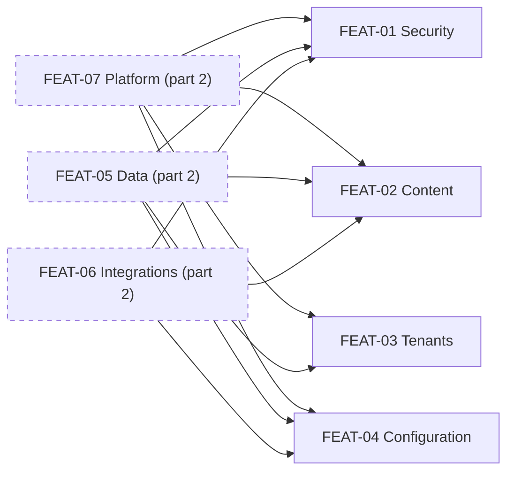
```mermaid
flowchart LR
  FEAT_01["FEAT-01 Security"]
  FEAT_02["FEAT-02 Content"]
  FEAT_03["FEAT-03 Tenants"]
  FEAT_04["FEAT-04 Configuration"]
  FEAT_07["FEAT-07 Platform (part 2)"]:::external
  FEAT_05["FEAT-05 Data (part 2)"]:::external
  FEAT_06["FEAT-06 Integrations (part 2)"]:::external
  FEAT_07 --> FEAT_01
  FEAT_05 --> FEAT_01
  FEAT_06 --> FEAT_01
  FEAT_07 --> FEAT_02
  FEAT_05 --> FEAT_02
  FEAT_06 --> FEAT_02
  FEAT_07 --> FEAT_03
  FEAT_05 --> FEAT_03
  FEAT_07 --> FEAT_04
  FEAT_05 --> FEAT_04
  FEAT_06 --> FEAT_04
  classDef external stroke-dasharray: 5 5
```

### Part 2 of 2

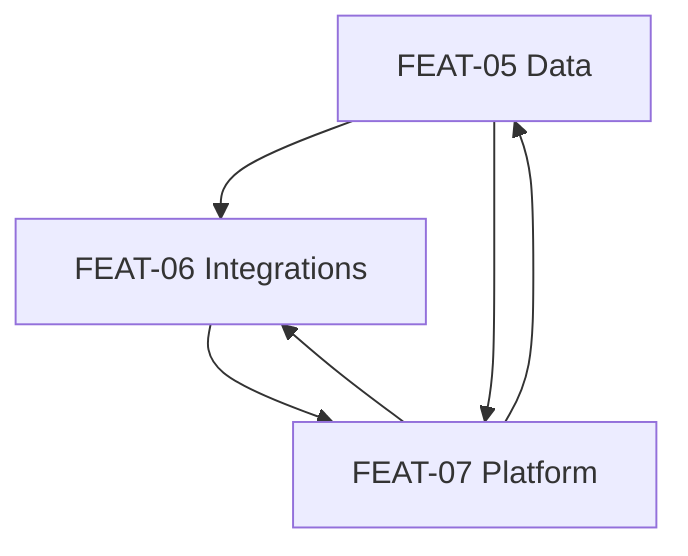
```mermaid
flowchart TD
  FEAT_05["FEAT-05 Data"]
  FEAT_06["FEAT-06 Integrations"]
  FEAT_07["FEAT-07 Platform"]
  FEAT_07 --> FEAT_05
  FEAT_07 --> FEAT_06
  FEAT_05 --> FEAT_06
  FEAT_06 --> FEAT_07
  FEAT_05 --> FEAT_07
```

## Dependency graph

An arrow points from an epic to one that needs it. Each milestone is drawn on its own, a big one in parts by wave; a dashed box is an epic drawn in another part.

### Milestone 1 — Walking skeleton, waves 1–2

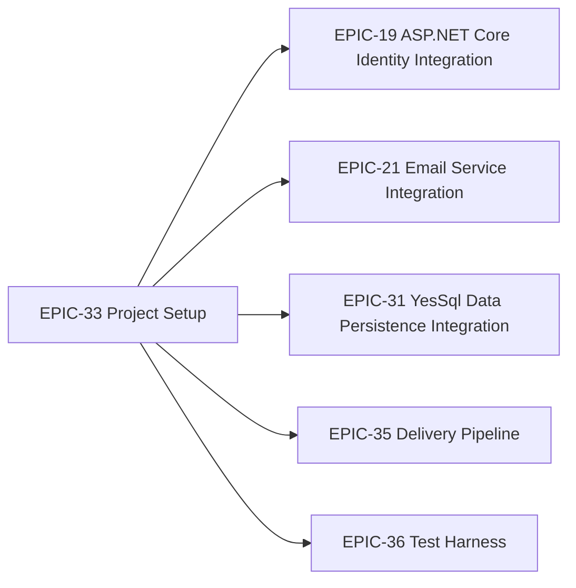
```mermaid
flowchart LR
  EPIC_33["EPIC-33 Project Setup"]
  EPIC_19["EPIC-19 ASP.NET Core Identity Integration"]
  EPIC_21["EPIC-21 Email Service Integration"]
  EPIC_31["EPIC-31 YesSql Data Persistence Integration"]
  EPIC_35["EPIC-35 Delivery Pipeline"]
  EPIC_36["EPIC-36 Test Harness"]
  EPIC_33 --> EPIC_19
  EPIC_33 --> EPIC_21
  EPIC_33 --> EPIC_31
  EPIC_33 --> EPIC_35
  EPIC_33 --> EPIC_36
```

### Milestone 1 — Walking skeleton, waves 3–4

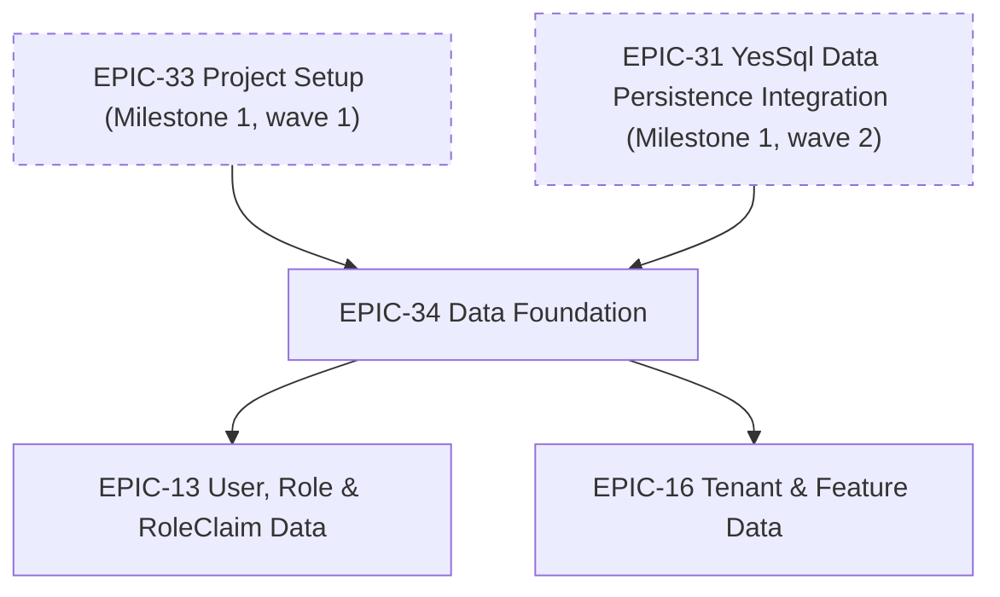
```mermaid
flowchart TD
  EPIC_34["EPIC-34 Data Foundation"]
  EPIC_13["EPIC-13 User, Role & RoleClaim Data"]
  EPIC_16["EPIC-16 Tenant & Feature Data"]
  EPIC_33["EPIC-33 Project Setup (Milestone 1, wave 1)"]:::external
  EPIC_31["EPIC-31 YesSql Data Persistence Integration (Milestone 1, wave 2)"]:::external
  EPIC_33 --> EPIC_34
  EPIC_31 --> EPIC_34
  EPIC_34 --> EPIC_13
  EPIC_34 --> EPIC_16
  classDef external stroke-dasharray: 5 5
```

### Milestone 1 — Walking skeleton, wave 5

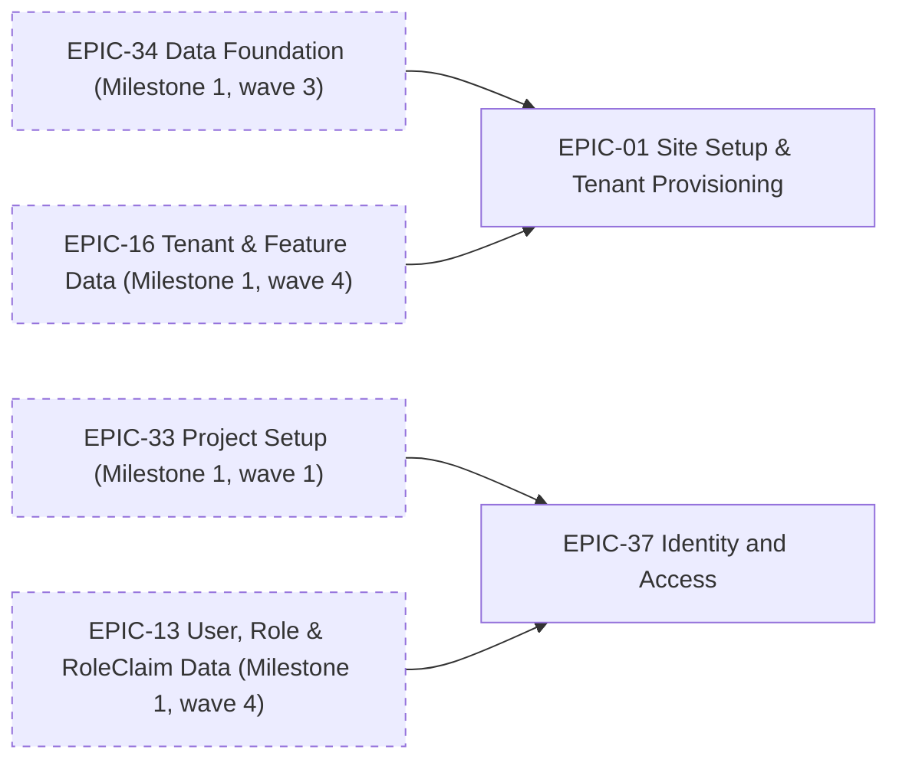
```mermaid
flowchart LR
  EPIC_01["EPIC-01 Site Setup & Tenant Provisioning"]
  EPIC_37["EPIC-37 Identity and Access"]
  EPIC_34["EPIC-34 Data Foundation (Milestone 1, wave 3)"]:::external
  EPIC_16["EPIC-16 Tenant & Feature Data (Milestone 1, wave 4)"]:::external
  EPIC_33["EPIC-33 Project Setup (Milestone 1, wave 1)"]:::external
  EPIC_13["EPIC-13 User, Role & RoleClaim Data (Milestone 1, wave 4)"]:::external
  EPIC_34 --> EPIC_01
  EPIC_16 --> EPIC_01
  EPIC_33 --> EPIC_37
  EPIC_13 --> EPIC_37
  classDef external stroke-dasharray: 5 5
```

### Milestone 1 — Walking skeleton, wave 6

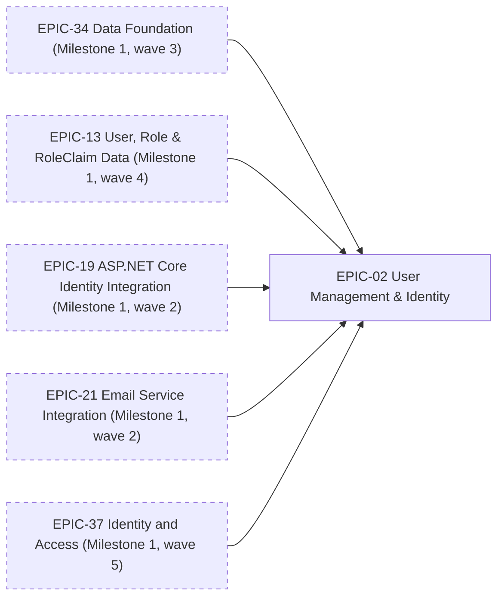
```mermaid
flowchart LR
  EPIC_02["EPIC-02 User Management & Identity"]
  EPIC_34["EPIC-34 Data Foundation (Milestone 1, wave 3)"]:::external
  EPIC_13["EPIC-13 User, Role & RoleClaim Data (Milestone 1, wave 4)"]:::external
  EPIC_19["EPIC-19 ASP.NET Core Identity Integration (Milestone 1, wave 2)"]:::external
  EPIC_21["EPIC-21 Email Service Integration (Milestone 1, wave 2)"]:::external
  EPIC_37["EPIC-37 Identity and Access (Milestone 1, wave 5)"]:::external
  EPIC_34 --> EPIC_02
  EPIC_13 --> EPIC_02
  EPIC_19 --> EPIC_02
  EPIC_21 --> EPIC_02
  EPIC_37 --> EPIC_02
  classDef external stroke-dasharray: 5 5
```

### Milestone 2 — First release, wave 1

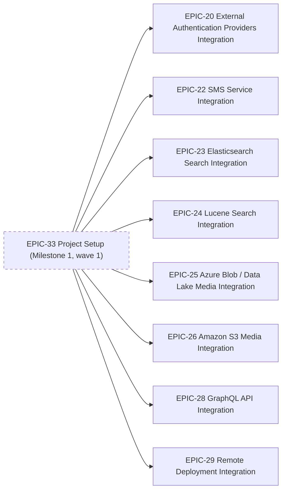
```mermaid
flowchart LR
  EPIC_20["EPIC-20 External Authentication Providers Integration"]
  EPIC_22["EPIC-22 SMS Service Integration"]
  EPIC_23["EPIC-23 Elasticsearch Search Integration"]
  EPIC_24["EPIC-24 Lucene Search Integration"]
  EPIC_25["EPIC-25 Azure Blob / Data Lake Media Integration"]
  EPIC_26["EPIC-26 Amazon S3 Media Integration"]
  EPIC_28["EPIC-28 GraphQL API Integration"]
  EPIC_29["EPIC-29 Remote Deployment Integration"]
  EPIC_33["EPIC-33 Project Setup (Milestone 1, wave 1)"]:::external
  EPIC_33 --> EPIC_20
  EPIC_33 --> EPIC_22
  EPIC_33 --> EPIC_23
  EPIC_33 --> EPIC_24
  EPIC_33 --> EPIC_25
  EPIC_33 --> EPIC_26
  EPIC_33 --> EPIC_28
  EPIC_33 --> EPIC_29
  classDef external stroke-dasharray: 5 5
```

### Milestone 2 — First release, waves 1–2

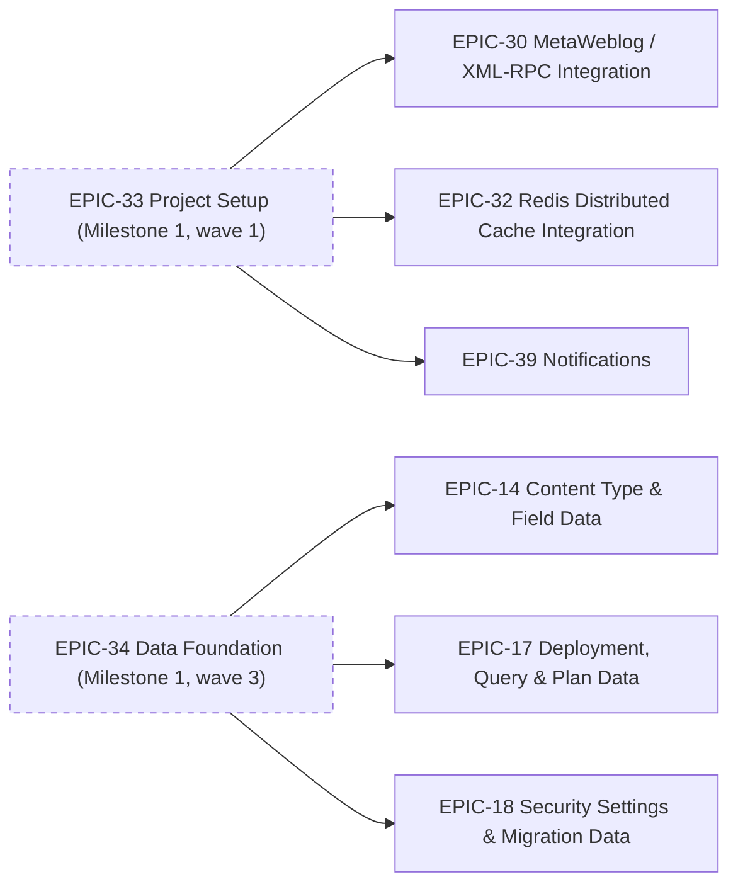
```mermaid
flowchart LR
  EPIC_30["EPIC-30 MetaWeblog / XML-RPC Integration"]
  EPIC_32["EPIC-32 Redis Distributed Cache Integration"]
  EPIC_39["EPIC-39 Notifications"]
  EPIC_14["EPIC-14 Content Type & Field Data"]
  EPIC_17["EPIC-17 Deployment, Query & Plan Data"]
  EPIC_18["EPIC-18 Security Settings & Migration Data"]
  EPIC_33["EPIC-33 Project Setup (Milestone 1, wave 1)"]:::external
  EPIC_34["EPIC-34 Data Foundation (Milestone 1, wave 3)"]:::external
  EPIC_33 --> EPIC_30
  EPIC_33 --> EPIC_32
  EPIC_33 --> EPIC_39
  EPIC_34 --> EPIC_14
  EPIC_34 --> EPIC_17
  EPIC_34 --> EPIC_18
  classDef external stroke-dasharray: 5 5
```

### Milestone 2 — First release, wave 3

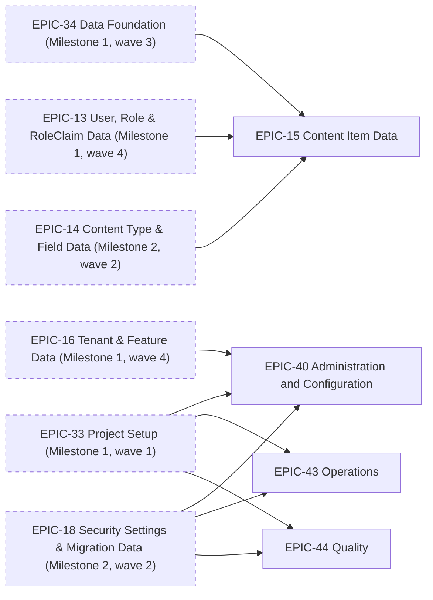
```mermaid
flowchart LR
  EPIC_15["EPIC-15 Content Item Data"]
  EPIC_40["EPIC-40 Administration and Configuration"]
  EPIC_43["EPIC-43 Operations"]
  EPIC_44["EPIC-44 Quality"]
  EPIC_34["EPIC-34 Data Foundation (Milestone 1, wave 3)"]:::external
  EPIC_13["EPIC-13 User, Role & RoleClaim Data (Milestone 1, wave 4)"]:::external
  EPIC_14["EPIC-14 Content Type & Field Data (Milestone 2, wave 2)"]:::external
  EPIC_33["EPIC-33 Project Setup (Milestone 1, wave 1)"]:::external
  EPIC_16["EPIC-16 Tenant & Feature Data (Milestone 1, wave 4)"]:::external
  EPIC_18["EPIC-18 Security Settings & Migration Data (Milestone 2, wave 2)"]:::external
  EPIC_34 --> EPIC_15
  EPIC_13 --> EPIC_15
  EPIC_14 --> EPIC_15
  EPIC_33 --> EPIC_40
  EPIC_16 --> EPIC_40
  EPIC_18 --> EPIC_40
  EPIC_33 --> EPIC_43
  EPIC_18 --> EPIC_43
  EPIC_33 --> EPIC_44
  EPIC_18 --> EPIC_44
  classDef external stroke-dasharray: 5 5
```

### Milestone 2 — First release, wave 4 (part 1 of 2)

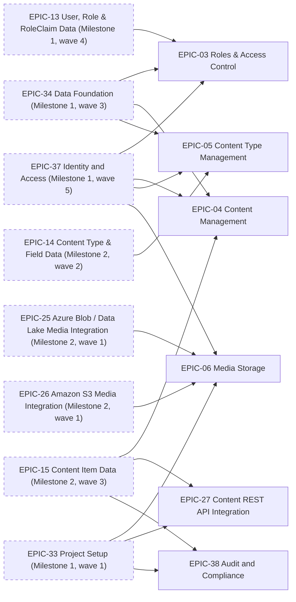
```mermaid
flowchart LR
  EPIC_03["EPIC-03 Roles & Access Control"]
  EPIC_04["EPIC-04 Content Management"]
  EPIC_05["EPIC-05 Content Type Management"]
  EPIC_06["EPIC-06 Media Storage"]
  EPIC_27["EPIC-27 Content REST API Integration"]
  EPIC_38["EPIC-38 Audit and Compliance"]
  EPIC_34["EPIC-34 Data Foundation (Milestone 1, wave 3)"]:::external
  EPIC_13["EPIC-13 User, Role & RoleClaim Data (Milestone 1, wave 4)"]:::external
  EPIC_37["EPIC-37 Identity and Access (Milestone 1, wave 5)"]:::external
  EPIC_15["EPIC-15 Content Item Data (Milestone 2, wave 3)"]:::external
  EPIC_14["EPIC-14 Content Type & Field Data (Milestone 2, wave 2)"]:::external
  EPIC_33["EPIC-33 Project Setup (Milestone 1, wave 1)"]:::external
  EPIC_25["EPIC-25 Azure Blob / Data Lake Media Integration (Milestone 2, wave 1)"]:::external
  EPIC_26["EPIC-26 Amazon S3 Media Integration (Milestone 2, wave 1)"]:::external
  EPIC_34 --> EPIC_03
  EPIC_13 --> EPIC_03
  EPIC_37 --> EPIC_03
  EPIC_34 --> EPIC_04
  EPIC_15 --> EPIC_04
  EPIC_37 --> EPIC_04
  EPIC_34 --> EPIC_05
  EPIC_14 --> EPIC_05
  EPIC_37 --> EPIC_05
  EPIC_33 --> EPIC_06
  EPIC_25 --> EPIC_06
  EPIC_26 --> EPIC_06
  EPIC_37 --> EPIC_06
  EPIC_33 --> EPIC_27
  EPIC_15 --> EPIC_27
  EPIC_33 --> EPIC_38
  EPIC_15 --> EPIC_38
  classDef external stroke-dasharray: 5 5
```

### Milestone 2 — First release, wave 4 (part 2 of 2)

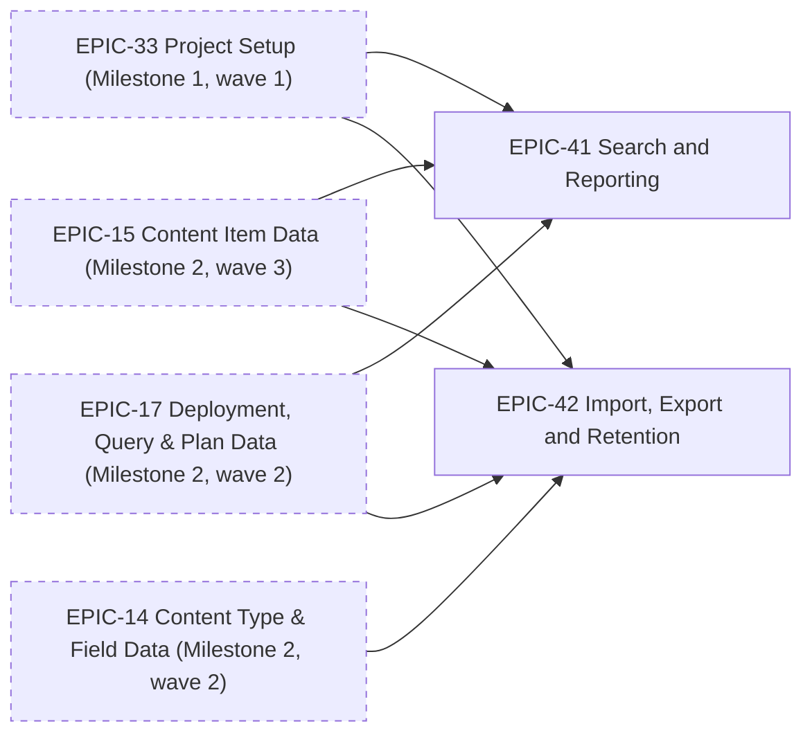
```mermaid
flowchart LR
  EPIC_41["EPIC-41 Search and Reporting"]
  EPIC_42["EPIC-42 Import, Export and Retention"]
  EPIC_33["EPIC-33 Project Setup (Milestone 1, wave 1)"]:::external
  EPIC_15["EPIC-15 Content Item Data (Milestone 2, wave 3)"]:::external
  EPIC_17["EPIC-17 Deployment, Query & Plan Data (Milestone 2, wave 2)"]:::external
  EPIC_14["EPIC-14 Content Type & Field Data (Milestone 2, wave 2)"]:::external
  EPIC_33 --> EPIC_41
  EPIC_15 --> EPIC_41
  EPIC_17 --> EPIC_41
  EPIC_33 --> EPIC_42
  EPIC_14 --> EPIC_42
  EPIC_15 --> EPIC_42
  EPIC_17 --> EPIC_42
  classDef external stroke-dasharray: 5 5
```

### Milestone 3 — Later release, wave 1

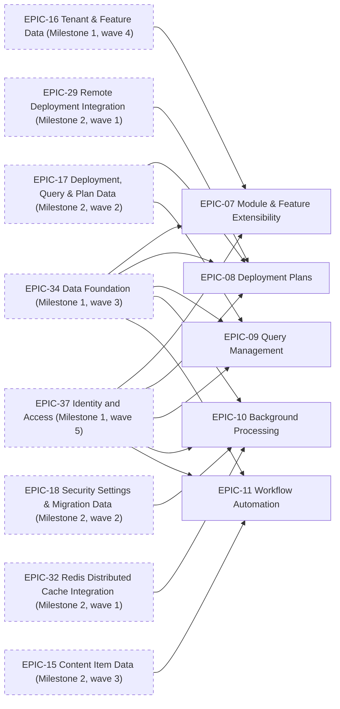
```mermaid
flowchart LR
  EPIC_07["EPIC-07 Module & Feature Extensibility"]
  EPIC_08["EPIC-08 Deployment Plans"]
  EPIC_09["EPIC-09 Query Management"]
  EPIC_10["EPIC-10 Background Processing"]
  EPIC_11["EPIC-11 Workflow Automation"]
  EPIC_34["EPIC-34 Data Foundation (Milestone 1, wave 3)"]:::external
  EPIC_16["EPIC-16 Tenant & Feature Data (Milestone 1, wave 4)"]:::external
  EPIC_37["EPIC-37 Identity and Access (Milestone 1, wave 5)"]:::external
  EPIC_17["EPIC-17 Deployment, Query & Plan Data (Milestone 2, wave 2)"]:::external
  EPIC_29["EPIC-29 Remote Deployment Integration (Milestone 2, wave 1)"]:::external
  EPIC_18["EPIC-18 Security Settings & Migration Data (Milestone 2, wave 2)"]:::external
  EPIC_32["EPIC-32 Redis Distributed Cache Integration (Milestone 2, wave 1)"]:::external
  EPIC_15["EPIC-15 Content Item Data (Milestone 2, wave 3)"]:::external
  EPIC_34 --> EPIC_07
  EPIC_16 --> EPIC_07
  EPIC_37 --> EPIC_07
  EPIC_34 --> EPIC_08
  EPIC_17 --> EPIC_08
  EPIC_29 --> EPIC_08
  EPIC_37 --> EPIC_08
  EPIC_34 --> EPIC_09
  EPIC_17 --> EPIC_09
  EPIC_37 --> EPIC_09
  EPIC_34 --> EPIC_10
  EPIC_18 --> EPIC_10
  EPIC_32 --> EPIC_10
  EPIC_37 --> EPIC_10
  EPIC_34 --> EPIC_11
  EPIC_15 --> EPIC_11
  EPIC_37 --> EPIC_11
  classDef external stroke-dasharray: 5 5
```

### Milestone 3 — Later release, wave 2

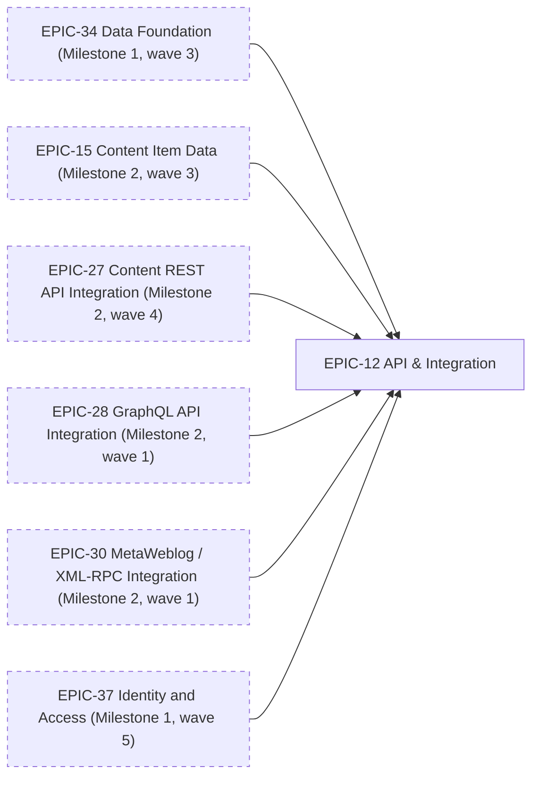
```mermaid
flowchart LR
  EPIC_12["EPIC-12 API & Integration"]
  EPIC_34["EPIC-34 Data Foundation (Milestone 1, wave 3)"]:::external
  EPIC_15["EPIC-15 Content Item Data (Milestone 2, wave 3)"]:::external
  EPIC_27["EPIC-27 Content REST API Integration (Milestone 2, wave 4)"]:::external
  EPIC_28["EPIC-28 GraphQL API Integration (Milestone 2, wave 1)"]:::external
  EPIC_30["EPIC-30 MetaWeblog / XML-RPC Integration (Milestone 2, wave 1)"]:::external
  EPIC_37["EPIC-37 Identity and Access (Milestone 1, wave 5)"]:::external
  EPIC_34 --> EPIC_12
  EPIC_15 --> EPIC_12
  EPIC_27 --> EPIC_12
  EPIC_28 --> EPIC_12
  EPIC_30 --> EPIC_12
  EPIC_37 --> EPIC_12
  classDef external stroke-dasharray: 5 5
```

## Story dependencies

An arrow points from a story to one that needs it. A dashed box is a story of another epic, or one drawn in another part.

### EPIC-01 Site Setup & Tenant Provisioning

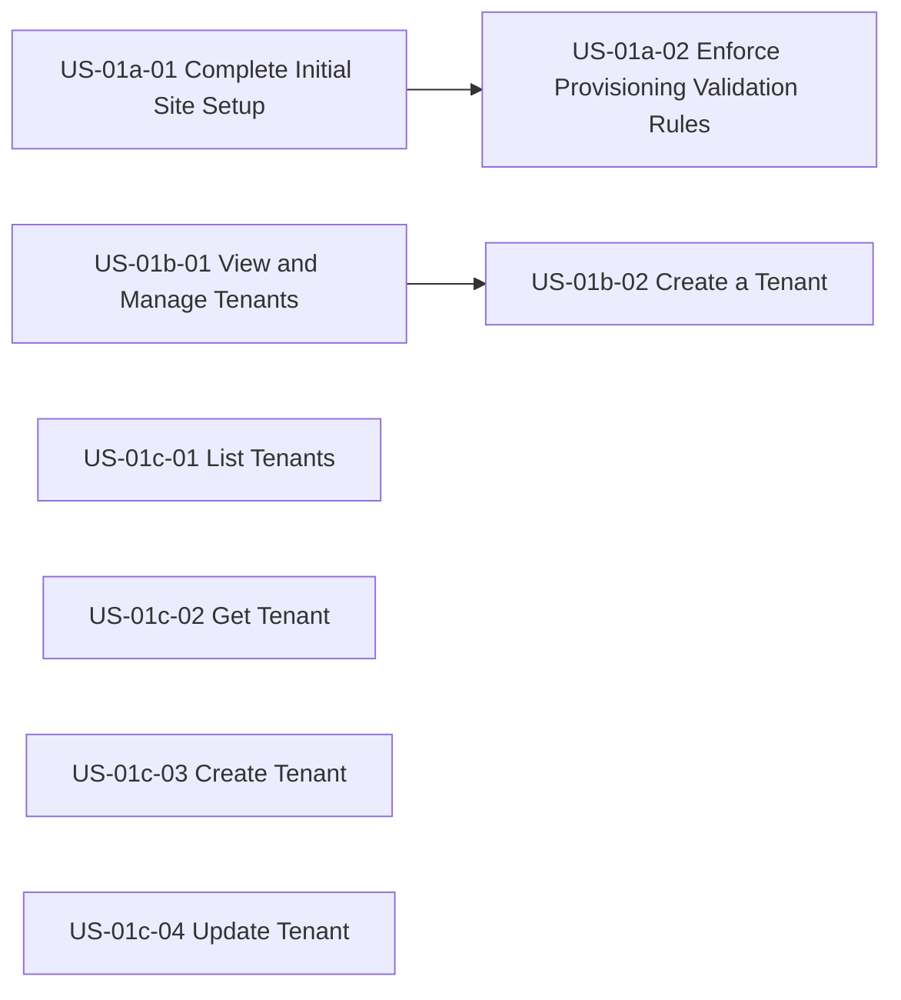
```mermaid
flowchart LR
  US_01a_01["US-01a-01 Complete Initial Site Setup"]
  US_01a_02["US-01a-02 Enforce Provisioning Validation Rules"]
  US_01b_01["US-01b-01 View and Manage Tenants"]
  US_01b_02["US-01b-02 Create a Tenant"]
  US_01c_01["US-01c-01 List Tenants"]
  US_01c_02["US-01c-02 Get Tenant"]
  US_01c_03["US-01c-03 Create Tenant"]
  US_01c_04["US-01c-04 Update Tenant"]
  US_01a_01 --> US_01a_02
  US_01b_01 --> US_01b_02
```

### EPIC-02 User Management & Identity — slices 02a–02c

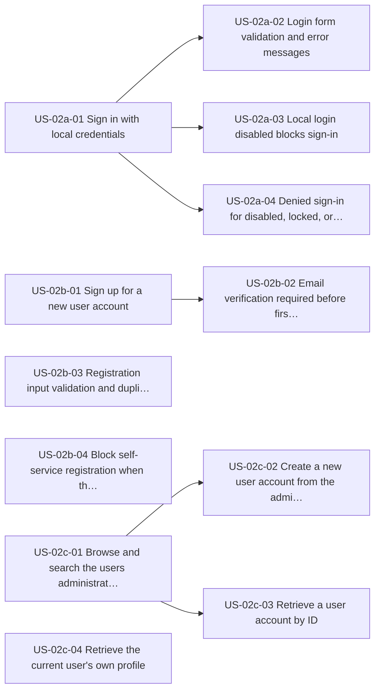
```mermaid
flowchart LR
  US_02a_01["US-02a-01 Sign in with local credentials"]
  US_02a_02["US-02a-02 Login form validation and error messages"]
  US_02a_03["US-02a-03 Local login disabled blocks sign-in"]
  US_02a_04["US-02a-04 Denied sign-in for disabled, locked, or…"]
  US_02b_01["US-02b-01 Sign up for a new user account"]
  US_02b_02["US-02b-02 Email verification required before firs…"]
  US_02b_03["US-02b-03 Registration input validation and dupli…"]
  US_02b_04["US-02b-04 Block self-service registration when th…"]
  US_02c_01["US-02c-01 Browse and search the users administrat…"]
  US_02c_02["US-02c-02 Create a new user account from the admi…"]
  US_02c_03["US-02c-03 Retrieve a user account by ID"]
  US_02c_04["US-02c-04 Retrieve the current user's own profile"]
  US_02a_01 --> US_02a_02
  US_02a_01 --> US_02a_03
  US_02a_01 --> US_02a_04
  US_02b_01 --> US_02b_02
  US_02c_01 --> US_02c_02
  US_02c_01 --> US_02c_03
```

### EPIC-02 User Management & Identity — slices 02d–02e

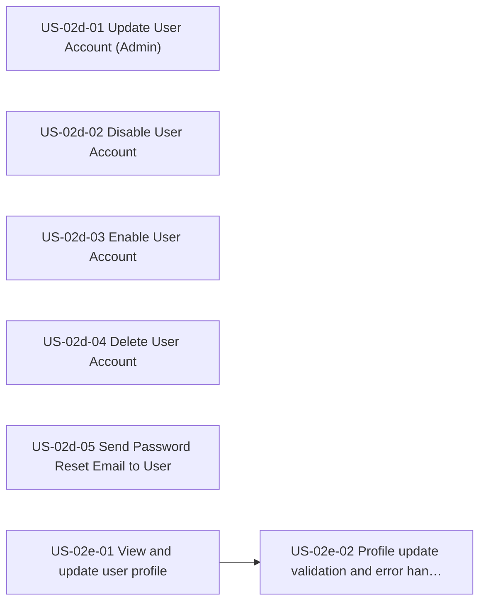
```mermaid
flowchart LR
  US_02d_01["US-02d-01 Update User Account (Admin)"]
  US_02d_02["US-02d-02 Disable User Account"]
  US_02d_03["US-02d-03 Enable User Account"]
  US_02d_04["US-02d-04 Delete User Account"]
  US_02d_05["US-02d-05 Send Password Reset Email to User"]
  US_02e_01["US-02e-01 View and update user profile"]
  US_02e_02["US-02e-02 Profile update validation and error han…"]
  US_02e_01 --> US_02e_02
```

### EPIC-03 Roles & Access Control

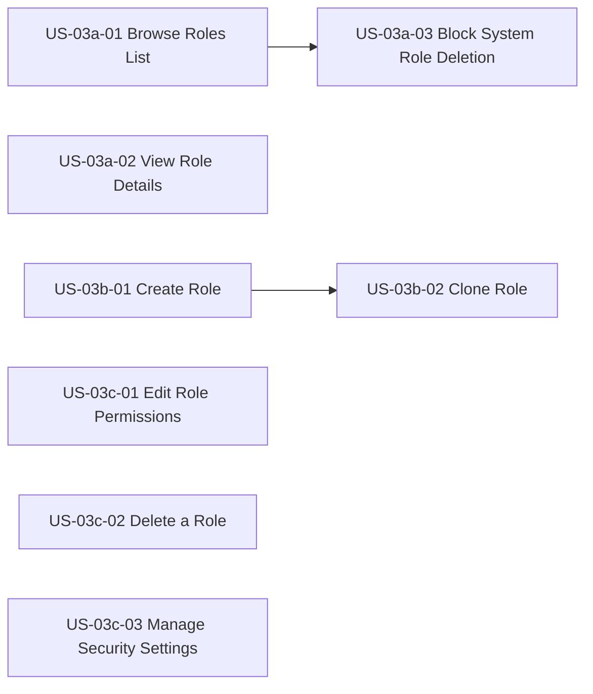
```mermaid
flowchart LR
  US_03a_01["US-03a-01 Browse Roles List"]
  US_03a_02["US-03a-02 View Role Details"]
  US_03a_03["US-03a-03 Block System Role Deletion"]
  US_03b_01["US-03b-01 Create Role"]
  US_03b_02["US-03b-02 Clone Role"]
  US_03c_01["US-03c-01 Edit Role Permissions"]
  US_03c_02["US-03c-02 Delete a Role"]
  US_03c_03["US-03c-03 Manage Security Settings"]
  US_03a_01 --> US_03a_03
  US_03b_01 --> US_03b_02
```

### EPIC-04 Content Management — slice 04a

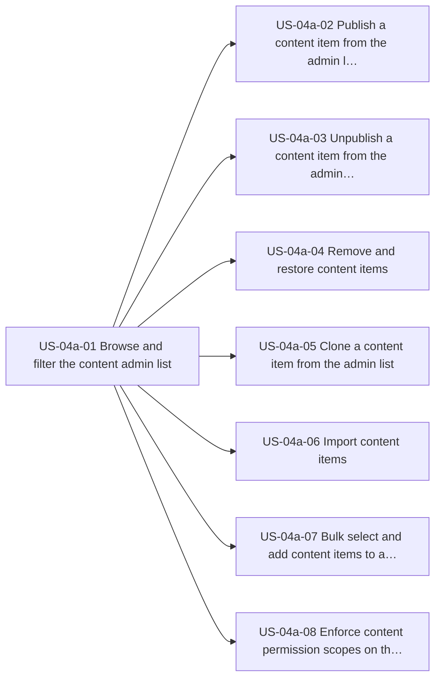
```mermaid
flowchart LR
  US_04a_01["US-04a-01 Browse and filter the content admin list"]
  US_04a_02["US-04a-02 Publish a content item from the admin l…"]
  US_04a_03["US-04a-03 Unpublish a content item from the admin…"]
  US_04a_04["US-04a-04 Remove and restore content items"]
  US_04a_05["US-04a-05 Clone a content item from the admin list"]
  US_04a_06["US-04a-06 Import content items"]
  US_04a_07["US-04a-07 Bulk select and add content items to a…"]
  US_04a_08["US-04a-08 Enforce content permission scopes on th…"]
  US_04a_01 --> US_04a_02
  US_04a_01 --> US_04a_03
  US_04a_01 --> US_04a_04
  US_04a_01 --> US_04a_05
  US_04a_01 --> US_04a_06
  US_04a_01 --> US_04a_07
  US_04a_01 --> US_04a_08
```

### EPIC-04 Content Management — slices 04b–04c

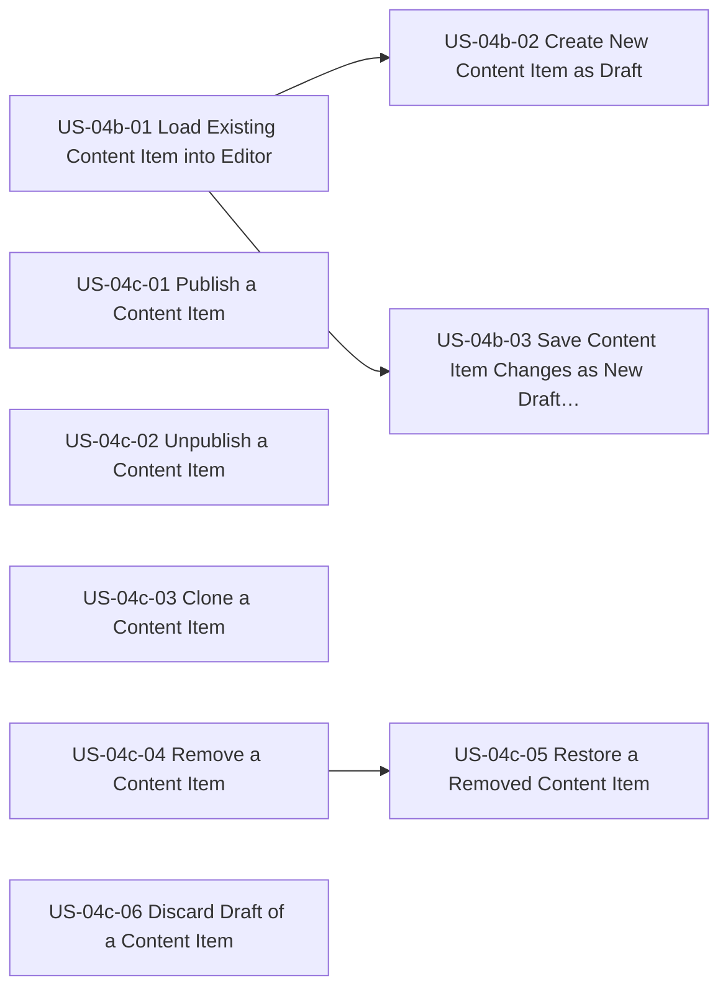
```mermaid
flowchart LR
  US_04b_01["US-04b-01 Load Existing Content Item into Editor"]
  US_04b_02["US-04b-02 Create New Content Item as Draft"]
  US_04b_03["US-04b-03 Save Content Item Changes as New Draft…"]
  US_04c_01["US-04c-01 Publish a Content Item"]
  US_04c_02["US-04c-02 Unpublish a Content Item"]
  US_04c_03["US-04c-03 Clone a Content Item"]
  US_04c_04["US-04c-04 Remove a Content Item"]
  US_04c_05["US-04c-05 Restore a Removed Content Item"]
  US_04c_06["US-04c-06 Discard Draft of a Content Item"]
  US_04b_01 --> US_04b_02
  US_04b_01 --> US_04b_03
  US_04c_04 --> US_04c_05
```

### EPIC-05 Content Type Management

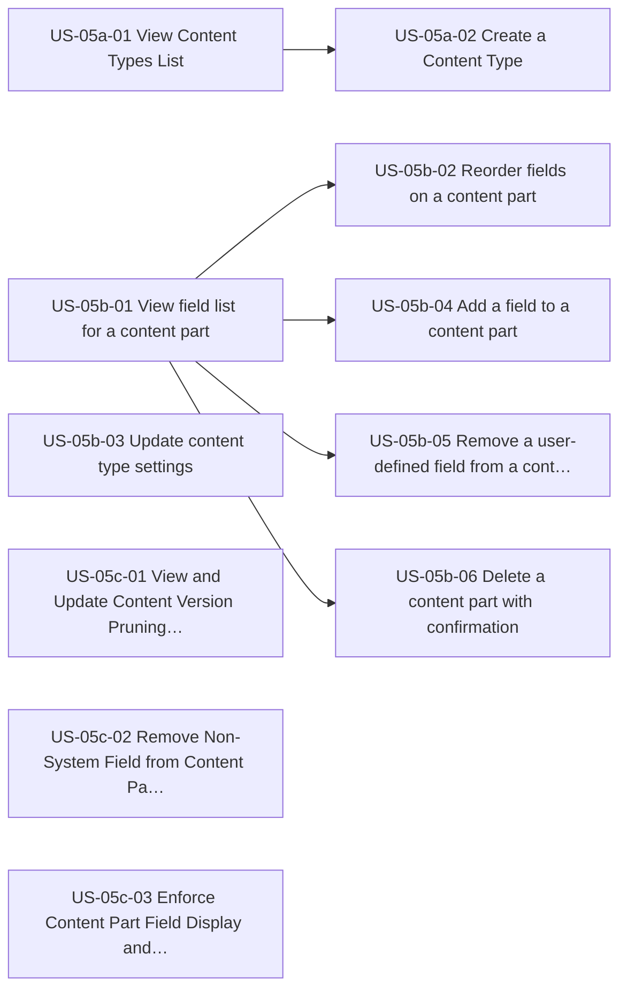
```mermaid
flowchart LR
  US_05a_01["US-05a-01 View Content Types List"]
  US_05a_02["US-05a-02 Create a Content Type"]
  US_05b_01["US-05b-01 View field list for a content part"]
  US_05b_02["US-05b-02 Reorder fields on a content part"]
  US_05b_03["US-05b-03 Update content type settings"]
  US_05b_04["US-05b-04 Add a field to a content part"]
  US_05b_05["US-05b-05 Remove a user-defined field from a cont…"]
  US_05b_06["US-05b-06 Delete a content part with confirmation"]
  US_05c_01["US-05c-01 View and Update Content Version Pruning…"]
  US_05c_02["US-05c-02 Remove Non-System Field from Content Pa…"]
  US_05c_03["US-05c-03 Enforce Content Part Field Display and…"]
  US_05a_01 --> US_05a_02
  US_05b_01 --> US_05b_02
  US_05b_01 --> US_05b_04
  US_05b_01 --> US_05b_05
  US_05b_01 --> US_05b_06
```

### EPIC-06 Media Storage

```mermaid
flowchart LR
  US_06a_01["US-06a-01 View Amazon S3 Media Options"]
  US_06a_02["US-06a-02 Save Amazon S3 Media Options"]
  US_06a_01 --> US_06a_02
```

### EPIC-07 Module & Feature Extensibility

```mermaid
flowchart LR
  US_07a_01["US-07a-01 Browse and Filter Features Administrati…"]
  US_07a_02["US-07a-02 Enable a Feature"]
  US_07a_03["US-07a-03 Disable a Feature"]
  US_07b_01["US-07b-01 Enable a Feature"]
  US_07b_02["US-07b-02 Disable a Feature"]
  US_07b_03["US-07b-03 Enforce External Authentication Feature…"]
  US_07a_01 --> US_07a_02
  US_07a_01 --> US_07a_03
  US_07b_01 --> US_07b_03
  US_07b_02 --> US_07b_03
```

### EPIC-08 Deployment Plans

```mermaid
flowchart LR
  US_08a_01["US-08a-01 View Deployment Plans"]
  US_08a_02["US-08a-02 Create Deployment Plan"]
  US_08a_03["US-08a-03 Delete Deployment Plan"]
  US_08a_04["US-08a-04 Add Deployment Step with ContentDefinit…"]
  US_08a_05["US-08a-05 Export Deployment Plan"]
  US_08a_06["US-08a-06 Import Deployment Package"]
  US_08b_01["US-08b-01 Add Deployment Step"]
  US_08b_02["US-08b-02 Export Deployment Plan"]
  US_08b_03["US-08b-03 Import Deployment Package"]
  US_08a_02 --> US_08a_04
```

### EPIC-09 Query Management

```mermaid
flowchart LR
  US_09a_01["US-09a-01 Browse Queries Administration Page"]
  US_09a_02["US-09a-02 View Named Query Definition"]
  US_09b_01["US-09b-01 Create a Named Query"]
  US_09b_02["US-09b-02 Update a Named Query"]
  US_09b_03["US-09b-03 Execute a Named Query"]
  US_09b_04["US-09b-04 Delete a Named Query"]
  US_09b_01 --> US_09b_02
  US_09b_01 --> US_09b_03
  US_09b_01 --> US_09b_04
```

### EPIC-10 Background Processing

```mermaid
flowchart LR
  US_10a_01["US-10a-01 Configure Background Processing Polling…"]
  US_10a_02["US-10a-02 Modular Background Service Architecture"]
  US_10a_03["US-10a-03 Per-Tenant Background Task Execution"]
  US_10a_04["US-10a-04 Distributed Locking for Background Tasks"]
  US_10a_02 --> US_10a_01
  US_10a_02 --> US_10a_03
  US_10a_02 --> US_10a_04
```

### EPIC-11 Workflow Automation

```mermaid
flowchart LR
  US_11a_01["US-11a-01 Configure Workflow Task Settings"]
  US_11a_02["US-11a-02 Save Workflow Task Configuration via API"]
  US_11b_01["US-11b-01 Configure Content Expression for Publis…"]
  US_11b_02["US-11b-02 Enforce User Task Action Gating via Use…"]
  US_11b_03["US-11b-03 Gate Workflow Rule Evaluation on Minimu…"]
  US_11a_01 --> US_11a_02
```

### EPIC-12 API & Integration

```mermaid
flowchart LR
  US_12a_01["US-12a-01 Retrieve a published content item via e…"]
  US_12a_02["US-12a-02 Create a content item via external REST…"]
  US_12a_03["US-12a-03 API serialization correctness with Syst…"]
  US_12b_01["US-12b-01 Query CMS Content via External GraphQL…"]
  US_12b_02["US-12b-02 Mutate CMS Content via External GraphQL…"]
  US_12b_03["US-12b-03 Receive MetaWeblog XML-RPC Remote Publi…"]
  US_12b_01 --> US_12b_02
```

### EPIC-13 User, Role & RoleClaim Data (part 1 of 2)

```mermaid
flowchart LR
  US_13a_01["US-13a-01 Create User"]
  US_13a_02["US-13a-02 List and Retrieve Users"]
  US_13a_03["US-13a-03 Update User Attributes"]
  US_13a_04["US-13a-04 Disable and Enable User"]
  US_13a_05["US-13a-05 Delete User"]
  US_13a_06["US-13a-06 Create Role"]
  US_13a_07["US-13a-07 List and Retrieve Roles with Claims"]
  US_13a_08["US-13a-08 Update Role Permissions"]
  US_13a_09["US-13a-09 Clone Role"]
  US_13a_10["US-13a-10 Delete Role"]
  US_13a_01 --> US_13a_02
  US_13a_01 --> US_13a_03
  US_13a_01 --> US_13a_04
  US_13a_01 --> US_13a_05
  US_13a_06 --> US_13a_07
  US_13a_06 --> US_13a_08
  US_13a_06 --> US_13a_09
  US_13a_06 --> US_13a_10
```

### EPIC-13 User, Role & RoleClaim Data (part 2 of 2)

```mermaid
flowchart LR
  US_13a_11["US-13a-11 Record Last Login Timestamp"]
  US_13a_01["US-13a-01 (part 1)"]:::external
  US_13a_01 --> US_13a_11
  classDef external stroke-dasharray: 5 5
```

### EPIC-14 Content Type & Field Data (part 1 of 2)

```mermaid
flowchart TD
  US_14a_01["US-14a-01 List Content Types"]
  US_14a_02["US-14a-02 Create Content Type"]
  US_14a_03["US-14a-03 Update Content Type"]
  US_14a_04["US-14a-04 List Content Part Fields"]
  US_14a_05["US-14a-05 Add Field to Content Part"]
  US_14a_06["US-14a-06 Reorder Content Part Fields"]
  US_14a_01 --> US_14a_02
  US_14a_02 --> US_14a_03
  US_14a_01 --> US_14a_04
  US_14a_04 --> US_14a_05
  US_14a_05 --> US_14a_06
```

### EPIC-14 Content Type & Field Data (part 2 of 2)

```mermaid
flowchart LR
  US_14a_07["US-14a-07 Remove Field from Content Part"]
  US_14a_08["US-14a-08 Manage Content Version Pruning Settings"]
  US_14a_04["US-14a-04 (part 1)"]:::external
  US_14a_01["US-14a-01 (part 1)"]:::external
  US_14a_04 --> US_14a_07
  US_14a_01 --> US_14a_08
  classDef external stroke-dasharray: 5 5
```

### EPIC-15 Content Item Data (part 1 of 3)

```mermaid
flowchart TD
  US_15a_01["US-15a-01 Create Content Item (Draft)"]
  US_15a_02["US-15a-02 Update Content Item Draft"]
  US_15a_03["US-15a-03 Publish and Unpublish Content Item"]
  US_15a_01 --> US_15a_02
  US_15a_01 --> US_15a_03
  US_15a_02 --> US_15a_03
```

### EPIC-15 Content Item Data (part 2 of 3)

```mermaid
flowchart LR
  US_15a_04["US-15a-04 Remove and Restore Content Item"]
  US_15a_05["US-15a-05 List and Get Content Items"]
  US_15a_06["US-15a-06 Clone and Discard Draft Content Item"]
  US_15a_07["US-15a-07 Import Content Items"]
  US_15a_01["US-15a-01 (part 1)"]:::external
  US_15a_03["US-15a-03 (part 1)"]:::external
  US_15a_01 --> US_15a_04
  US_15a_01 --> US_15a_05
  US_15a_01 --> US_15a_06
  US_15a_03 --> US_15a_06
  classDef external stroke-dasharray: 5 5
```

### EPIC-15 Content Item Data (part 3 of 3)

```mermaid
flowchart LR
  US_15a_08["US-15a-08 External API Access for Content Items"]
  US_15a_01["US-15a-01 (part 1)"]:::external
  US_15a_05["US-15a-05 (part 2)"]:::external
  US_15a_01 --> US_15a_08
  US_15a_05 --> US_15a_08
  classDef external stroke-dasharray: 5 5
```

### EPIC-16 Tenant & Feature Data

```mermaid
flowchart LR
  US_16a_01["US-16a-01 Create Tenant"]
  US_16a_02["US-16a-02 List and Retrieve Tenants"]
  US_16a_03["US-16a-03 Update Tenant Configuration"]
  US_16a_04["US-16a-04 Transition Tenant from Uninitialized to…"]
  US_16a_05["US-16a-05 Seed and Query Feature Catalogue"]
  US_16a_06["US-16a-06 Enable Feature"]
  US_16a_07["US-16a-07 Disable Feature"]
  US_16a_01 --> US_16a_02
  US_16a_01 --> US_16a_03
  US_16a_01 --> US_16a_04
  US_16a_05 --> US_16a_06
  US_16a_05 --> US_16a_07
```

### EPIC-17 Deployment, Query & Plan Data (part 1 of 2)

```mermaid
flowchart LR
  US_17a_01["US-17a-01 Create a Deployment Plan"]
  US_17a_02["US-17a-02 List and Delete Deployment Plans"]
  US_17a_03["US-17a-03 Add a Deployment Step to a Plan"]
  US_17a_01 --> US_17a_02
  US_17a_01 --> US_17a_03
```

### EPIC-17 Deployment, Query & Plan Data (part 2 of 2)

```mermaid
flowchart LR
  US_17a_04["US-17a-04 Export a Deployment Plan"]
  US_17a_05["US-17a-05 Import a Deployment Package"]
  US_17a_06["US-17a-06 Create a Query"]
  US_17a_07["US-17a-07 List and Get Queries"]
  US_17a_08["US-17a-08 Update a Query"]
  US_17a_09["US-17a-09 Execute a Query"]
  US_17a_10["US-17a-10 Delete a Query"]
  US_17a_01["US-17a-01 (part 1)"]:::external
  US_17a_03["US-17a-03 (part 1)"]:::external
  US_17a_01 --> US_17a_04
  US_17a_03 --> US_17a_04
  US_17a_01 --> US_17a_05
  US_17a_06 --> US_17a_07
  US_17a_06 --> US_17a_08
  US_17a_06 --> US_17a_09
  US_17a_06 --> US_17a_10
  classDef external stroke-dasharray: 5 5
```

### EPIC-18 Security Settings & Migration Data

```mermaid
flowchart LR
  US_18a_01["US-18a-01 Retrieve Security Settings"]
  US_18a_02["US-18a-02 Update Security Settings"]
  US_18a_03["US-18a-03 List Data Migration Records"]
  US_18a_01 --> US_18a_02
```

### EPIC-19 ASP.NET Core Identity Integration

```mermaid
flowchart LR
  US_19a_01["US-19a-01 Create User via ASP.NET Core Identity U…"]
  US_19a_02["US-19a-02 Authenticate User via ASP.NET Core Iden…"]
  US_19a_03["US-19a-03 Retrieve User via ASP.NET Core Identity…"]
  US_19a_04["US-19a-04 UserService Error Handling and Guard Co…"]
  US_19a_01 --> US_19a_02
  US_19a_01 --> US_19a_03
  US_19a_01 --> US_19a_04
```

### EPIC-20 External Authentication Providers Integration

```mermaid
flowchart LR
  US_20a_01["US-20a-01 Initiate External OAuth/OIDC Authentica…"]
  US_20a_02["US-20a-02 Complete External Authentication via Pr…"]
  US_20a_03["US-20a-03 Enforce Client Secret Requirement for C…"]
  US_20a_01 --> US_20a_02
```

### EPIC-21 Email Service Integration

```mermaid
flowchart LR
  US_21a_01["US-21a-01 Send Email Verification on User Registr…"]
  US_21a_02["US-21a-02 Send Password Reset Email via Azure Com…"]
  US_21a_03["US-21a-03 Configure Azure Communication Services…"]
  US_21a_03 --> US_21a_01
  US_21a_03 --> US_21a_02
```

### EPIC-22 SMS Service Integration

```mermaid
flowchart TD
  US_22a_01["US-22a-01 Configure SMS Service Settings"]
  US_22a_02["US-22a-02 Send Outbound SMS Notification via Azur…"]
  US_22a_03["US-22a-03 Handle SMS Send Failure from Azure Comm…"]
  US_22a_01 --> US_22a_02
  US_22a_01 --> US_22a_03
  US_22a_02 --> US_22a_03
```

### EPIC-23 Elasticsearch Search Integration (part 1 of 2)

```mermaid
flowchart LR
  US_23a_01["US-23a-01 Configure Elasticsearch Connection"]
  US_23a_02["US-23a-02 Index Content Items in Elasticsearch on…"]
  US_23a_03["US-23a-03 Remove Content Items from Elasticsearch…"]
  US_23a_01 --> US_23a_02
  US_23a_01 --> US_23a_03
```

### EPIC-23 Elasticsearch Search Integration (part 2 of 2)

```mermaid
flowchart LR
  US_23a_04["US-23a-04 Search Content via Elasticsearch"]
  US_23a_05["US-23a-05 Handle Elasticsearch Integration Failur…"]
  US_23a_01["US-23a-01 (part 1)"]:::external
  US_23a_02["US-23a-02 (part 1)"]:::external
  US_23a_01 --> US_23a_04
  US_23a_02 --> US_23a_04
  US_23a_01 --> US_23a_05
  classDef external stroke-dasharray: 5 5
```

### EPIC-24 Lucene Search Integration

```mermaid
flowchart LR
  US_24a_01["US-24a-01 Enable and Configure Lucene Search Feat…"]
  US_24a_02["US-24a-02 Index Content Items on Publish, Update,…"]
  US_24a_03["US-24a-03 Define and Execute Lucene Search Queries"]
  US_24a_01 --> US_24a_02
  US_24a_01 --> US_24a_03
```

### EPIC-25 Azure Blob / Data Lake Media Integration (part 1 of 2)

```mermaid
flowchart TD
  US_25a_01["US-25a-01 Configure Azure Blob/Data Lake Storage…"]
  US_25a_02["US-25a-02 Upload Media File to Azure Blob/Data La…"]
  US_25a_03["US-25a-03 Retrieve Media File from Azure Blob/Dat…"]
  US_25a_01 --> US_25a_02
  US_25a_01 --> US_25a_03
  US_25a_02 --> US_25a_03
```

### EPIC-25 Azure Blob / Data Lake Media Integration (part 2 of 2)

```mermaid
flowchart LR
  US_25a_04["US-25a-04 Delete Media File from Azure Blob/Data…"]
  US_25a_05["US-25a-05 Log Azure Storage Operation Errors as N…"]
  US_25a_01["US-25a-01 (part 1)"]:::external
  US_25a_01 --> US_25a_04
  US_25a_01 --> US_25a_05
  classDef external stroke-dasharray: 5 5
```

### EPIC-26 Amazon S3 Media Integration

```mermaid
flowchart LR
  US_26a_01["US-26a-01 Configure Amazon S3 Media Storage Setti…"]
  US_26a_02["US-26a-02 Upload Media File to Amazon S3"]
  US_26a_03["US-26a-03 Retrieve Media File from Amazon S3"]
  US_26a_04["US-26a-04 Delete Media File from Amazon S3"]
  US_26a_01 --> US_26a_02
  US_26a_01 --> US_26a_03
  US_26a_01 --> US_26a_04
```

### EPIC-27 Content REST API Integration

```mermaid
flowchart LR
  US_27a_01["US-27a-01 Authenticate and Authorize REST API Acc…"]
  US_27a_02["US-27a-02 Create Content Item via REST API"]
  US_27a_03["US-27a-03 Retrieve Content Item via REST API"]
  US_27a_01 --> US_27a_02
  US_27a_01 --> US_27a_03
```

### EPIC-28 GraphQL API Integration

```mermaid
flowchart LR
  US_28a_01["US-28a-01 Execute a GraphQL Query to Retrieve Con…"]
  US_28a_02["US-28a-02 Execute a GraphQL Mutation to Write Con…"]
  US_28a_03["US-28a-03 Introspect the GraphQL API Schema"]
  US_28a_01 --> US_28a_02
  US_28a_01 --> US_28a_03
```

### EPIC-29 Remote Deployment Integration

```mermaid
flowchart TD
  US_29a_01["US-29a-01 Manage Remote Client Configuration"]
  US_29a_02["US-29a-02 Export Deployment Plan to Remote Orchar…"]
  US_29a_03["US-29a-03 Enforce Permission Gates for Remote Dep…"]
  US_29a_04["US-29a-04 Handle Remote Deployment HTTP Errors"]
  US_29a_01 --> US_29a_02
  US_29a_02 --> US_29a_04
```

### EPIC-30 MetaWeblog / XML-RPC Integration

```mermaid
flowchart LR
  US_30a_01["US-30a-01 Publish a blog post via MetaWeblog XML-…"]
  US_30a_02["US-30a-02 Enforce access control for MetaWeblog X…"]
  US_30a_03["US-30a-03 Return structured fault responses on Me…"]
  US_30a_01 --> US_30a_02
  US_30a_01 --> US_30a_03
```

### EPIC-31 YesSql Data Persistence Integration

```mermaid
flowchart LR
  US_31a_01["US-31a-01 Configure YesSql Database Connection an…"]
  US_31a_02["US-31a-02 Persist Entity Writes via YesSql Sessio…"]
  US_31a_03["US-31a-03 Retrieve Entities via YesSql Read Opera…"]
  US_31a_04["US-31a-04 Manage Schema Migrations via DataMigrat…"]
  US_31a_01 --> US_31a_02
  US_31a_01 --> US_31a_03
  US_31a_01 --> US_31a_04
```

### EPIC-32 Redis Distributed Cache Integration

```mermaid
flowchart LR
  US_32a_01["US-32a-01 Redis Feature Activation and Connection…"]
  US_32a_02["US-32a-02 Redis-backed Authentication Ticket Stor…"]
  US_32a_03["US-32a-03 Redis Distributed Lock for Background T…"]
  US_32a_01 --> US_32a_02
  US_32a_01 --> US_32a_03
```

### EPIC-33 Project Setup (part 1 of 4)

```mermaid
flowchart LR
  US_33a_01["US-33a-01 Initialise Orchard Core application rep…"]
  US_33a_02["US-33a-02 Run Orchard Core application locally"]
  US_33a_03["US-33a-03 Lint and format Orchard Core applicatio…"]
  US_33a_01 --> US_33a_02
  US_33a_01 --> US_33a_03
```

### EPIC-33 Project Setup (part 2 of 4)

```mermaid
flowchart LR
  US_33a_04["US-33a-04 Create README for Orchard Core applicat…"]
  US_33a_05["US-33a-05 Initialise documentation site scaffold"]
  US_33a_01["US-33a-01 (part 1)"]:::external
  US_33a_02["US-33a-02 (part 1)"]:::external
  US_33a_03["US-33a-03 (part 1)"]:::external
  US_33a_01 --> US_33a_04
  US_33a_02 --> US_33a_04
  US_33a_03 --> US_33a_04
  US_33a_01 --> US_33a_05
  classDef external stroke-dasharray: 5 5
```

### EPIC-33 Project Setup (part 3 of 4)

```mermaid
flowchart LR
  US_33a_06["US-33a-06 Run documentation site locally"]
  US_33a_07["US-33a-07 Lint and validate documentation site"]
  US_33a_05["US-33a-05 (part 2)"]:::external
  US_33a_05 --> US_33a_06
  US_33a_05 --> US_33a_07
  classDef external stroke-dasharray: 5 5
```

### EPIC-33 Project Setup (part 4 of 4)

```mermaid
flowchart LR
  US_33a_08["US-33a-08 Create README section for documentation…"]
  US_33a_04["US-33a-04 (part 2)"]:::external
  US_33a_05["US-33a-05 (part 2)"]:::external
  US_33a_06["US-33a-06 (part 3)"]:::external
  US_33a_07["US-33a-07 (part 3)"]:::external
  US_33a_04 --> US_33a_08
  US_33a_05 --> US_33a_08
  US_33a_06 --> US_33a_08
  US_33a_07 --> US_33a_08
  classDef external stroke-dasharray: 5 5
```

### EPIC-34 Data Foundation (part 1 of 2)

```mermaid
flowchart LR
  US_34a_01["US-34a-01 Provision YesSql Data Store and Initial…"]
  US_34a_02["US-34a-02 DataMigrationManager Idempotency and At…"]
  US_34a_03["US-34a-03 Apply Foundation Seed Data"]
  US_34a_01 --> US_34a_02
  US_34a_01 --> US_34a_03
```

### EPIC-34 Data Foundation (part 2 of 2)

```mermaid
flowchart LR
  US_34a_04["US-34a-04 View Schema Migration Records"]
  US_34a_01["US-34a-01 (part 1)"]:::external
  US_34a_02["US-34a-02 (part 1)"]:::external
  US_34a_01 --> US_34a_04
  US_34a_02 --> US_34a_04
  classDef external stroke-dasharray: 5 5
```

### EPIC-35 Delivery Pipeline

```mermaid
flowchart LR
  US_35a_01["US-35a-01 GitHub Actions CI/CD workflow"]
  US_35a_02["US-35a-02 Build quality gates"]
  US_35a_03["US-35a-03 Cross-platform unit testing"]
  US_35a_04["US-35a-04 Browser testing with Playwright"]
  US_35a_01 --> US_35a_02
  US_35a_01 --> US_35a_03
  US_35a_01 --> US_35a_04
```

### EPIC-36 Test Harness

```mermaid
flowchart LR
  US_36a_01["US-36a-01 Unit test harness — xUnit on Ubuntu and…"]
  US_36a_02["US-36a-02 API contract test harness — xUnit with…"]
  US_36a_03["US-36a-03 Integration test harness — LocalStack f…"]
  US_36a_04["US-36a-04 Browser functional test harness — Playw…"]
  US_36a_05["US-36a-05 Documentation test harness — MkDocs val…"]
  US_36a_01 --> US_36a_02
  US_36a_01 --> US_36a_03
  US_36a_01 --> US_36a_04
```

### EPIC-37 Identity and Access — slice 37a

```mermaid
flowchart LR
  US_37a_01["US-37a-01 Local Username/Password Login"]
  US_37a_02["US-37a-02 External OAuth2/OIDC Provider Authentic…"]
  US_37a_03["US-37a-03 Two-Factor Authentication and Local Log…"]
  US_37a_04["US-37a-04 Role-Based Authorization Framework"]
  US_37a_05["US-37a-05 Role Lifecycle Management"]
  US_37a_01 --> US_37a_03
  US_37a_04 --> US_37a_05
```

### EPIC-37 Identity and Access — slices 37a–37b

```mermaid
flowchart LR
  US_37a_06["US-37a-06 Built-in Role Definitions: Administrato…"]
  US_37b_01["US-37b-01 Configure Author role with create and e…"]
  US_37b_02["US-37b-02 Configure Contributor role with draft-o…"]
  US_37b_03["US-37b-03 Enforce Anonymous role access restricti…"]
  US_37b_04["US-37b-04 Enforce Authenticated base role permiss…"]
  US_37b_05["US-37b-05 Enforce authentication and role-based a…"]
  US_37a_04["US-37a-04 (part 1)"]:::external
  US_37a_05["US-37a-05 (part 1)"]:::external
  US_37a_04 --> US_37a_06
  US_37a_05 --> US_37a_06
  classDef external stroke-dasharray: 5 5
```

### EPIC-38 Audit and Compliance

```mermaid
flowchart TD
  US_38a_01["US-38a-01 Provision AuditTrailPart capability for…"]
  US_38a_02["US-38a-02 Emit and persist audit signals on conte…"]
  US_38a_03["US-38a-03 Administrator reviews the audit trail f…"]
  US_38a_01 --> US_38a_02
  US_38a_01 --> US_38a_03
  US_38a_02 --> US_38a_03
```

### EPIC-39 Notifications

```mermaid
flowchart TD
  US_39a_01["US-39a-01 Notifications Platform Capability"]
  US_39a_02["US-39a-02 View SMS Notification Settings"]
  US_39a_03["US-39a-03 Configure SMS Notification Settings"]
  US_39a_01 --> US_39a_02
  US_39a_01 --> US_39a_03
  US_39a_02 --> US_39a_03
```

### EPIC-40 Administration and Configuration

```mermaid
flowchart TD
  US_40a_01["US-40a-01 Admin Panel Permission Gating"]
  US_40a_02["US-40a-02 Retrieve Current Security Settings"]
  US_40a_03["US-40a-03 Update Security Settings"]
  US_40a_04["US-40a-04 Multi-Tenant Provisioning and Isolation"]
  US_40a_01 --> US_40a_02
  US_40a_02 --> US_40a_03
```

### EPIC-41 Search and Reporting (part 1 of 2)

```mermaid
flowchart TD
  US_41a_01["US-41a-01 Enable Search Provider"]
  US_41a_02["US-41a-02 Manage Search Indices"]
  US_41a_03["US-41a-03 Configure Custom Analyzers and Token Fi…"]
  US_41a_04["US-41a-04 Manage Named Queries"]
  US_41a_05["US-41a-05 Execute Named Query"]
  US_41a_01 --> US_41a_02
  US_41a_02 --> US_41a_03
  US_41a_01 --> US_41a_04
  US_41a_04 --> US_41a_05
```

### EPIC-41 Search and Reporting (part 2 of 2)

```mermaid
flowchart LR
  US_41a_06["US-41a-06 Index Content on Lifecycle Events"]
  US_41a_02["US-41a-02 (part 1)"]:::external
  US_41a_02 --> US_41a_06
  classDef external stroke-dasharray: 5 5
```

### EPIC-43 Operations

```mermaid
flowchart LR
  US_43a_01["US-43a-01 XML-RPC, Admin Route, and Migration Err…"]
  US_43a_02["US-43a-02 Background Task Distributed Lock Enforc…"]
  US_43a_03["US-43a-03 Application Observability, Structured L…"]
  US_43a_04["US-43a-04 YesSql Database and App_Data Backup and…"]
  US_43a_02 --> US_43a_03
```

## Critical path

EPIC-33 Project Setup → EPIC-31 YesSql Data Persistence Integration → EPIC-34 Data Foundation → EPIC-13 User, Role & RoleClaim Data → EPIC-37 Identity and Access → EPIC-04 Content Management — 249 points.

The heaviest chain of epics by story points. None of it can start before the epic before it is done, so it bounds how soon the backlog can be finished.

## Milestone 1 — Walking skeleton: Site Setup → Login

### Wave 1

#### EPIC-33 Project Setup

platform · P0 · 8 stories · 13 points

Needs first: nothing

| Order | Story | Priority | Points | Ready | Depends on |
|---|---|---|---|---|---|
| 1 | US-33a-01 Initialise Orchard Core application repository and module scaffold | P0 | 3 | yes | — |
| 2 | US-33a-02 Run Orchard Core application locally | P0 | 2 | yes | US-33a-01 |
| 3 | US-33a-03 Lint and format Orchard Core application source | P0 | 2 | yes | US-33a-01 |
| 4 | US-33a-05 Initialise documentation site scaffold | P0 | 1 | yes | US-33a-01 |
| 5 | US-33a-04 Create README for Orchard Core application | P0 | 1 | yes | US-33a-01, US-33a-02, US-33a-03 |
| 6 | US-33a-06 Run documentation site locally | P0 | 1 | yes | US-33a-05 |
| 7 | US-33a-07 Lint and validate documentation site | P0 | 2 | yes | US-33a-05 |
| 8 | US-33a-08 Create README section for documentation site | P0 | 1 | yes | US-33a-04, US-33a-05, US-33a-06, US-33a-07 |

### Wave 2

#### EPIC-19 ASP.NET Core Identity Integration

integration · P0 · 4 stories · 18 points

Needs first: EPIC-33

| Order | Story | Priority | Points | Ready | Depends on |
|---|---|---|---|---|---|
| 9 | US-19a-01 Create User via ASP.NET Core Identity UserService | P0 | 5 | yes | — |
| 10 | US-19a-02 Authenticate User via ASP.NET Core Identity UserService | P0 | 5 | yes | US-19a-01 |
| 11 | US-19a-03 Retrieve User via ASP.NET Core Identity UserService | P0 | 3 | yes | US-19a-01 |
| 12 | US-19a-04 UserService Error Handling and Guard Conditions | P0 | 5 | yes | US-19a-01 |

#### EPIC-21 Email Service Integration

integration · P0 · 3 stories · 13 points

Needs first: EPIC-33

| Order | Story | Priority | Points | Ready | Depends on |
|---|---|---|---|---|---|
| 13 | US-21a-03 Configure Azure Communication Services Email Provider | P0 | 3 | yes | — |
| 14 | US-21a-01 Send Email Verification on User Registration | P0 | 5 | no | US-21a-03 |
| 15 | US-21a-02 Send Password Reset Email via Azure Communication Services | P0 | 5 | yes | US-21a-03 |

#### EPIC-31 YesSql Data Persistence Integration

integration · P0 · 4 stories · 21 points

Needs first: EPIC-33

| Order | Story | Priority | Points | Ready | Depends on |
|---|---|---|---|---|---|
| 16 | US-31a-01 Configure YesSql Database Connection and Session Factory | P0 | 3 | yes | — |
| 17 | US-31a-02 Persist Entity Writes via YesSql Session Lifecycle | P0 | 8 | yes | US-31a-01 |
| 18 | US-31a-03 Retrieve Entities via YesSql Read Operations | P0 | 5 | yes | US-31a-01 |
| 19 | US-31a-04 Manage Schema Migrations via DataMigrationManager Idempotency | P0 | 5 | yes | US-31a-01 |

#### EPIC-35 Delivery Pipeline

platform · P0 · 4 stories · 20 points

Needs first: EPIC-33

| Order | Story | Priority | Points | Ready | Depends on |
|---|---|---|---|---|---|
| 20 | US-35a-01 GitHub Actions CI/CD workflow | P0 | 5 | yes | — |
| 21 | US-35a-02 Build quality gates | P0 | 5 | yes | US-35a-01 |
| 22 | US-35a-03 Cross-platform unit testing | P0 | 5 | yes | US-35a-01 |
| 23 | US-35a-04 Browser testing with Playwright | P0 | 5 | yes | US-35a-01 |

#### EPIC-36 Test Harness

platform · P0 · 5 stories · 29 points

Needs first: EPIC-33

| Order | Story | Priority | Points | Ready | Depends on |
|---|---|---|---|---|---|
| 24 | US-36a-01 Unit test harness — xUnit on Ubuntu and Windows | P0 | 5 | yes | — |
| 25 | US-36a-05 Documentation test harness — MkDocs validation in CI | P0 | 3 | yes | — |
| 26 | US-36a-02 API contract test harness — xUnit with in-process test host | P0 | 5 | yes | US-36a-01 |
| 27 | US-36a-03 Integration test harness — LocalStack for S3 and Azure Blob emulator | P0 | 8 | yes | US-36a-01 |
| 28 | US-36a-04 Browser functional test harness — Playwright on Chromium with App_Data cleanup and artefact upload | P0 | 8 | yes | US-36a-01 |

### Wave 3

#### EPIC-34 Data Foundation

platform · P0 · 4 stories · 16 points

Needs first: EPIC-33, EPIC-31

| Order | Story | Priority | Points | Ready | Depends on |
|---|---|---|---|---|---|
| 29 | US-34a-01 Provision YesSql Data Store and Initialize Schema | P0 | 5 | yes | — |
| 30 | US-34a-02 DataMigrationManager Idempotency and Atomic Error Handling | P0 | 5 | yes | US-34a-01 |
| 31 | US-34a-03 Apply Foundation Seed Data | P0 | 3 | yes | US-34a-01 |
| 32 | US-34a-04 View Schema Migration Records | P0 | 3 | yes | US-34a-01, US-34a-02 |

### Wave 4

#### EPIC-13 User, Role & RoleClaim Data

data · P0 · 11 stories · 37 points

Needs first: EPIC-34

| Order | Story | Priority | Points | Ready | Depends on |
|---|---|---|---|---|---|
| 33 | US-13a-01 Create User | P0 | 5 | yes | — |
| 34 | US-13a-06 Create Role | P0 | 5 | yes | — |
| 35 | US-13a-02 List and Retrieve Users | P0 | 3 | yes | US-13a-01 |
| 36 | US-13a-03 Update User Attributes | P0 | 3 | yes | US-13a-01 |
| 37 | US-13a-04 Disable and Enable User | P0 | 3 | yes | US-13a-01 |
| 38 | US-13a-05 Delete User | P0 | 2 | yes | US-13a-01 |
| 39 | US-13a-07 List and Retrieve Roles with Claims | P0 | 3 | yes | US-13a-06 |
| 40 | US-13a-08 Update Role Permissions | P0 | 5 | yes | US-13a-06 |
| 41 | US-13a-09 Clone Role | P0 | 3 | yes | US-13a-06 |
| 42 | US-13a-10 Delete Role | P0 | 3 | yes | US-13a-06 |
| 43 | US-13a-11 Record Last Login Timestamp | P0 | 2 | yes | US-13a-01 |

#### EPIC-16 Tenant & Feature Data

data · P0 · 7 stories · 32 points

Needs first: EPIC-34

| Order | Story | Priority | Points | Ready | Depends on |
|---|---|---|---|---|---|
| 44 | US-16a-01 Create Tenant | P0 | 8 | yes | — |
| 45 | US-16a-05 Seed and Query Feature Catalogue | P0 | 5 | yes | — |
| 46 | US-16a-02 List and Retrieve Tenants | P0 | 3 | yes | US-16a-01 |
| 47 | US-16a-03 Update Tenant Configuration | P0 | 3 | yes | US-16a-01 |
| 48 | US-16a-04 Transition Tenant from Uninitialized to Running | P0 | 3 | yes | US-16a-01 |
| 49 | US-16a-06 Enable Feature | P0 | 5 | yes | US-16a-05 |
| 50 | US-16a-07 Disable Feature | P0 | 5 | yes | US-16a-05 |

### Wave 5

#### EPIC-01 Site Setup & Tenant Provisioning

functional · P0 · 8 stories · 34 points

Needs first: EPIC-34, EPIC-16

| Order | Story | Priority | Points | Ready | Depends on |
|---|---|---|---|---|---|
| 51 | US-01a-01 Complete Initial Site Setup | P0 | 8 | yes | — |
| 52 | US-01b-01 View and Manage Tenants | P0 | 3 | yes | — |
| 53 | US-01c-01 List Tenants | P0 | 3 | yes | — |
| 54 | US-01c-02 Get Tenant | P0 | 2 | yes | — |
| 55 | US-01c-03 Create Tenant | P0 | 5 | no | — |
| 56 | US-01c-04 Update Tenant | P0 | 3 | yes | — |
| 57 | US-01a-02 Enforce Provisioning Validation Rules | P0 | 5 | yes | US-01a-01 |
| 58 | US-01b-02 Create a Tenant | P0 | 5 | yes | US-01b-01 |

#### EPIC-37 Identity and Access

platform · P0 · 16 stories · 79 points

Needs first: EPIC-33, EPIC-13

| Order | Story | Priority | Points | Ready | Depends on |
|---|---|---|---|---|---|
| 59 | US-37a-01 Local Username/Password Login | P0 | 5 | yes | — |
| 60 | US-37a-02 External OAuth2/OIDC Provider Authentication | P0 | 8 | yes | — |
| 61 | US-37a-04 Role-Based Authorization Framework | P0 | 8 | yes | — |
| 62 | US-37b-01 Configure Author role with create and edit content permissions | P0 | 5 | yes | — |
| 63 | US-37b-02 Configure Contributor role with draft-only content permissions | P0 | 5 | yes | — |
| 64 | US-37b-03 Enforce Anonymous role access restrictions for unauthenticated visitors | P0 | 5 | yes | — |
| 65 | US-37b-04 Enforce Authenticated base role permissions for all logged-in users | P0 | 3 | yes | — |
| 66 | US-37b-05 Enforce authentication and role-based authorisation on all admin panel routes | P0 | 8 | yes | — |
| 67 | US-37c-01 Permission set persistence across feature enable/disable cycles | P0 | 5 | yes | — |
| 68 | US-37c-02 Anonymous role authentication type fixed to null so IsAuthenticated is false | P0 | 3 | yes | — |
| 69 | US-37c-03 ViewRoles permission implied by ManageRoles assignment | P0 | 3 | yes | — |
| 70 | US-37c-04 Permission gathering restricted to enabled features with duplicate-name detection | P0 | 5 | yes | — |
| 71 | US-37c-05 Upgrade-time security caveat for roles with no permissions assigned | P0 | 3 | yes | — |
| 72 | US-37a-03 Two-Factor Authentication and Local Login Policy | P0 | 5 | yes | US-37a-01 |
| 73 | US-37a-05 Role Lifecycle Management | P0 | 5 | yes | US-37a-04 |
| 74 | US-37a-06 Built-in Role Definitions: Administrator, Editor, Moderator | P0 | 3 | yes | US-37a-04, US-37a-05 |

### Wave 6

#### EPIC-02 User Management & Identity

functional · P0 · 19 stories · 72 points

Needs first: EPIC-34, EPIC-13, EPIC-19, EPIC-21, EPIC-37

| Order | Story | Priority | Points | Ready | Depends on |
|---|---|---|---|---|---|
| 75 | US-02a-01 Sign in with local credentials | P0 | 5 | yes | — |
| 76 | US-02b-01 Sign up for a new user account | P0 | 5 | yes | — |
| 77 | US-02b-03 Registration input validation and duplicate rejection | P0 | 5 | yes | — |
| 78 | US-02b-04 Block self-service registration when the feature is disabled | P0 | 3 | yes | — |
| 79 | US-02c-01 Browse and search the users administration list | P0 | 3 | yes | — |
| 80 | US-02c-04 Retrieve the current user's own profile | P1 | 2 | yes | — |
| 81 | US-02d-01 Update User Account (Admin) | P0 | 8 | no | — |
| 82 | US-02d-02 Disable User Account | P0 | 3 | yes | — |
| 83 | US-02d-03 Enable User Account | P0 | 2 | yes | — |
| 84 | US-02d-04 Delete User Account | P0 | 2 | yes | — |
| 85 | US-02d-05 Send Password Reset Email to User | P0 | 3 | yes | — |
| 86 | US-02e-01 View and update user profile | P0 | 5 | yes | — |
| 87 | US-02a-02 Login form validation and error messages | P0 | 3 | yes | US-02a-01 |
| 88 | US-02a-03 Local login disabled blocks sign-in | P0 | 2 | yes | US-02a-01 |
| 89 | US-02a-04 Denied sign-in for disabled, locked, or 2FA-required accounts | P0 | 3 | yes | US-02a-01 |
| 90 | US-02b-02 Email verification required before first login | P0 | 5 | yes | US-02b-01 |
| 91 | US-02c-02 Create a new user account from the admin panel | P0 | 8 | yes | US-02c-01 |
| 92 | US-02c-03 Retrieve a user account by ID | P0 | 2 | yes | US-02c-01 |
| 93 | US-02e-02 Profile update validation and error handling | P0 | 3 | yes | US-02e-01 |

## Milestone 2 — First release

### Wave 1

#### EPIC-20 External Authentication Providers Integration

integration · P1 · 3 stories · 16 points

Needs first: EPIC-33

| Order | Story | Priority | Points | Ready | Depends on |
|---|---|---|---|---|---|
| 94 | US-20a-01 Initiate External OAuth/OIDC Authentication | P1 | 5 | yes | — |
| 95 | US-20a-03 Enforce Client Secret Requirement for Confidential OAuth Providers | P1 | 3 | yes | — |
| 96 | US-20a-02 Complete External Authentication via Provider Callback | P1 | 8 | yes | US-20a-01 |

#### EPIC-22 SMS Service Integration

integration · P1 · 3 stories · 13 points

Needs first: EPIC-33

| Order | Story | Priority | Points | Ready | Depends on |
|---|---|---|---|---|---|
| 97 | US-22a-01 Configure SMS Service Settings | P1 | 5 | yes | — |
| 98 | US-22a-02 Send Outbound SMS Notification via Azure Communication Services | P1 | 5 | yes | US-22a-01 |
| 99 | US-22a-03 Handle SMS Send Failure from Azure Communication Services | P1 | 3 | yes | US-22a-01, US-22a-02 |

#### EPIC-23 Elasticsearch Search Integration

integration · P1 · 5 stories · 19 points

Needs first: EPIC-33

| Order | Story | Priority | Points | Ready | Depends on |
|---|---|---|---|---|---|
| 100 | US-23a-01 Configure Elasticsearch Connection | P1 | 3 | yes | — |
| 101 | US-23a-02 Index Content Items in Elasticsearch on Publish or Update | P1 | 5 | yes | US-23a-01 |
| 102 | US-23a-03 Remove Content Items from Elasticsearch Index on Unpublish or Removal | P1 | 3 | yes | US-23a-01 |
| 103 | US-23a-05 Handle Elasticsearch Integration Failures Gracefully | P1 | 3 | yes | US-23a-01 |
| 104 | US-23a-04 Search Content via Elasticsearch | P1 | 5 | yes | US-23a-01, US-23a-02 |

#### EPIC-24 Lucene Search Integration

integration · P1 · 3 stories · 18 points

Needs first: EPIC-33

| Order | Story | Priority | Points | Ready | Depends on |
|---|---|---|---|---|---|
| 105 | US-24a-01 Enable and Configure Lucene Search Feature | P1 | 5 | no | — |
| 106 | US-24a-02 Index Content Items on Publish, Update, and Removal | P1 | 8 | no | US-24a-01 |
| 107 | US-24a-03 Define and Execute Lucene Search Queries | P1 | 5 | no | US-24a-01 |

#### EPIC-25 Azure Blob / Data Lake Media Integration

integration · P1 · 5 stories · 19 points

Needs first: EPIC-33

| Order | Story | Priority | Points | Ready | Depends on |
|---|---|---|---|---|---|
| 108 | US-25a-01 Configure Azure Blob/Data Lake Storage Integration | P1 | 5 | no | — |
| 109 | US-25a-02 Upload Media File to Azure Blob/Data Lake Storage | P1 | 5 | no | US-25a-01 |
| 110 | US-25a-04 Delete Media File from Azure Blob/Data Lake Storage | P1 | 3 | yes | US-25a-01 |
| 111 | US-25a-05 Log Azure Storage Operation Errors as Non-Fatal | P1 | 3 | no | US-25a-01 |
| 112 | US-25a-03 Retrieve Media File from Azure Blob/Data Lake Storage | P1 | 3 | yes | US-25a-01, US-25a-02 |

#### EPIC-26 Amazon S3 Media Integration

integration · P1 · 4 stories · 16 points

Needs first: EPIC-33

| Order | Story | Priority | Points | Ready | Depends on |
|---|---|---|---|---|---|
| 113 | US-26a-01 Configure Amazon S3 Media Storage Settings | P1 | 5 | yes | — |
| 114 | US-26a-02 Upload Media File to Amazon S3 | P1 | 5 | yes | US-26a-01 |
| 115 | US-26a-03 Retrieve Media File from Amazon S3 | P1 | 3 | yes | US-26a-01 |
| 116 | US-26a-04 Delete Media File from Amazon S3 | P1 | 3 | no | US-26a-01 |

#### EPIC-28 GraphQL API Integration

integration · P1 · 3 stories · 13 points

Needs first: EPIC-33

| Order | Story | Priority | Points | Ready | Depends on |
|---|---|---|---|---|---|
| 117 | US-28a-01 Execute a GraphQL Query to Retrieve Content Data | P1 | 5 | yes | — |
| 118 | US-28a-02 Execute a GraphQL Mutation to Write Content Data | P1 | 5 | yes | US-28a-01 |
| 119 | US-28a-03 Introspect the GraphQL API Schema | P1 | 3 | yes | US-28a-01 |

#### EPIC-29 Remote Deployment Integration

integration · P1 · 4 stories · 19 points

Needs first: EPIC-33

| Order | Story | Priority | Points | Ready | Depends on |
|---|---|---|---|---|---|
| 120 | US-29a-01 Manage Remote Client Configuration | P1 | 5 | yes | — |
| 121 | US-29a-03 Enforce Permission Gates for Remote Deployment Operations | P1 | 3 | yes | — |
| 122 | US-29a-02 Export Deployment Plan to Remote Orchard Core Instance | P1 | 8 | yes | US-29a-01 |
| 123 | US-29a-04 Handle Remote Deployment HTTP Errors | P1 | 3 | yes | US-29a-02 |

#### EPIC-30 MetaWeblog / XML-RPC Integration

integration · P1 · 3 stories · 11 points

Needs first: EPIC-33

| Order | Story | Priority | Points | Ready | Depends on |
|---|---|---|---|---|---|
| 124 | US-30a-01 Publish a blog post via MetaWeblog XML-RPC | P1 | 5 | yes | — |
| 125 | US-30a-02 Enforce access control for MetaWeblog XML-RPC operations via CheckAccessAsync | P1 | 3 | yes | US-30a-01 |
| 126 | US-30a-03 Return structured fault responses on MetaWeblog XML-RPC errors | P1 | 3 | yes | US-30a-01 |

#### EPIC-32 Redis Distributed Cache Integration

integration · P1 · 3 stories · 15 points

Needs first: EPIC-33

| Order | Story | Priority | Points | Ready | Depends on |
|---|---|---|---|---|---|
| 127 | US-32a-01 Redis Feature Activation and Connection Configuration | P1 | 5 | yes | — |
| 128 | US-32a-02 Redis-backed Authentication Ticket Storage and Retrieval | P1 | 5 | yes | US-32a-01 |
| 129 | US-32a-03 Redis Distributed Lock for Background Task Coordination | P1 | 5 | yes | US-32a-01 |

#### EPIC-39 Notifications

platform · P1 · 3 stories · 13 points

Needs first: EPIC-33

| Order | Story | Priority | Points | Ready | Depends on |
|---|---|---|---|---|---|
| 130 | US-39a-01 Notifications Platform Capability | P1 | 5 | yes | — |
| 131 | US-39a-02 View SMS Notification Settings | P1 | 3 | yes | US-39a-01 |
| 132 | US-39a-03 Configure SMS Notification Settings | P1 | 5 | yes | US-39a-01, US-39a-02 |

### Wave 2

#### EPIC-14 Content Type & Field Data

data · P1 · 8 stories · 30 points

Needs first: EPIC-34

| Order | Story | Priority | Points | Ready | Depends on |
|---|---|---|---|---|---|
| 133 | US-14a-01 List Content Types | P1 | 2 | yes | — |
| 134 | US-14a-02 Create Content Type | P1 | 5 | yes | US-14a-01 |
| 135 | US-14a-04 List Content Part Fields | P1 | 2 | yes | US-14a-01 |
| 136 | US-14a-08 Manage Content Version Pruning Settings | P1 | 5 | yes | US-14a-01 |
| 137 | US-14a-03 Update Content Type | P1 | 5 | yes | US-14a-02 |
| 138 | US-14a-05 Add Field to Content Part | P1 | 5 | yes | US-14a-04 |
| 139 | US-14a-07 Remove Field from Content Part | P1 | 3 | yes | US-14a-04 |
| 140 | US-14a-06 Reorder Content Part Fields | P1 | 3 | yes | US-14a-05 |

#### EPIC-17 Deployment, Query & Plan Data

data · P1 · 10 stories · 31 points

Needs first: EPIC-34

| Order | Story | Priority | Points | Ready | Depends on |
|---|---|---|---|---|---|
| 141 | US-17a-01 Create a Deployment Plan | P1 | 3 | yes | — |
| 142 | US-17a-06 Create a Query | P1 | 3 | yes | — |
| 143 | US-17a-02 List and Delete Deployment Plans | P1 | 3 | yes | US-17a-01 |
| 144 | US-17a-03 Add a Deployment Step to a Plan | P1 | 5 | yes | US-17a-01 |
| 145 | US-17a-05 Import a Deployment Package | P1 | 3 | yes | US-17a-01 |
| 146 | US-17a-07 List and Get Queries | P1 | 3 | yes | US-17a-06 |
| 147 | US-17a-08 Update a Query | P1 | 3 | yes | US-17a-06 |
| 148 | US-17a-09 Execute a Query | P1 | 3 | yes | US-17a-06 |
| 149 | US-17a-10 Delete a Query | P1 | 2 | yes | US-17a-06 |
| 150 | US-17a-04 Export a Deployment Plan | P1 | 3 | yes | US-17a-01, US-17a-03 |

#### EPIC-18 Security Settings & Migration Data

data · P1 · 3 stories · 11 points

Needs first: EPIC-34

| Order | Story | Priority | Points | Ready | Depends on |
|---|---|---|---|---|---|
| 151 | US-18a-01 Retrieve Security Settings | P1 | 3 | yes | — |
| 152 | US-18a-03 List Data Migration Records | P1 | 3 | yes | — |
| 153 | US-18a-02 Update Security Settings | P1 | 5 | yes | US-18a-01 |

### Wave 3

#### EPIC-15 Content Item Data

data · P1 · 8 stories · 35 points

Needs first: EPIC-34, EPIC-13, EPIC-14

| Order | Story | Priority | Points | Ready | Depends on |
|---|---|---|---|---|---|
| 154 | US-15a-01 Create Content Item (Draft) | P1 | 5 | yes | — |
| 155 | US-15a-07 Import Content Items | P1 | 3 | yes | — |
| 156 | US-15a-02 Update Content Item Draft | P1 | 5 | yes | US-15a-01 |
| 157 | US-15a-04 Remove and Restore Content Item | P1 | 3 | yes | US-15a-01 |
| 158 | US-15a-05 List and Get Content Items | P1 | 3 | yes | US-15a-01 |
| 159 | US-15a-03 Publish and Unpublish Content Item | P1 | 5 | yes | US-15a-01, US-15a-02 |
| 160 | US-15a-08 External API Access for Content Items | P1 | 8 | yes | US-15a-01, US-15a-05 |
| 161 | US-15a-06 Clone and Discard Draft Content Item | P1 | 3 | yes | US-15a-01, US-15a-03 |

#### EPIC-40 Administration and Configuration

platform · P1 · 4 stories · 24 points

Needs first: EPIC-33, EPIC-16, EPIC-18

| Order | Story | Priority | Points | Ready | Depends on |
|---|---|---|---|---|---|
| 162 | US-40a-01 Admin Panel Permission Gating | P1 | 5 | yes | — |
| 163 | US-40a-04 Multi-Tenant Provisioning and Isolation | P1 | 8 | yes | — |
| 164 | US-40a-02 Retrieve Current Security Settings | P1 | 3 | yes | US-40a-01 |
| 165 | US-40a-03 Update Security Settings | P1 | 8 | no | US-40a-02 |

#### EPIC-43 Operations

platform · P1 · 4 stories · 23 points

Needs first: EPIC-33, EPIC-18

| Order | Story | Priority | Points | Ready | Depends on |
|---|---|---|---|---|---|
| 166 | US-43a-01 XML-RPC, Admin Route, and Migration Error Handling | P1 | 5 | yes | — |
| 167 | US-43a-02 Background Task Distributed Lock Enforcement | P1 | 5 | yes | — |
| 168 | US-43a-04 YesSql Database and App_Data Backup and Recovery | P1 | 5 | yes | — |
| 169 | US-43a-03 Application Observability, Structured Logging, and CI Artefact Capture | P1 | 8 | yes | US-43a-02 |

#### EPIC-44 Quality

platform · P1 · 17 stories · 72 points

Needs first: EPIC-33, EPIC-18

| Order | Story | Priority | Points | Ready | Depends on |
|---|---|---|---|---|---|
| 170 | US-44a-01 Login Timing-Attack Normalization | P1 | 3 | yes | — |
| 171 | US-44a-02 Configurable Security Response Headers | P1 | 3 | yes | — |
| 172 | US-44a-03 External Authentication Rate Limiting | P1 | 3 | yes | — |
| 173 | US-44a-04 Admin Role Permission Immutability | P1 | 5 | yes | — |
| 174 | US-44a-05 System Role Deletion Prevention | P1 | 2 | yes | — |
| 175 | US-44a-06 Security-Critical Permission Flagging | P1 | 5 | yes | — |
| 176 | US-44a-07 WCAG 2.1 AA Accessibility Compliance | P1 | 5 | yes | — |
| 177 | US-44a-08 Platform Performance Targets | P1 | 5 | yes | — |
| 178 | US-44b-01 External Authentication Rate Limiting Enforcement | P1 | 3 | yes | — |
| 179 | US-44b-02 Security Headers Configurability | P1 | 3 | yes | — |
| 180 | US-44b-03 Distributed Authentication Ticket Storage for Multi-Instance Deployment | P1 | 3 | yes | — |
| 181 | US-44b-04 System-Type Content Part Structural Integrity Protection | P1 | 3 | yes | — |
| 182 | US-44b-05 Personal Data Privacy and Secure Storage | P1 | 3 | yes | — |
| 183 | US-44c-01 Page Response Performance | P1 | 5 | yes | — |
| 184 | US-44c-02 High Availability with Redis Distributed Cache | P1 | 8 | yes | — |
| 185 | US-44c-03 WCAG 2.1 AA Accessibility | P1 | 8 | yes | — |
| 186 | US-44c-04 Browser and Device Compatibility | P1 | 5 | yes | — |

### Wave 4

#### EPIC-03 Roles & Access Control

functional · P1 · 8 stories · 37 points

Needs first: EPIC-34, EPIC-13, EPIC-37

| Order | Story | Priority | Points | Ready | Depends on |
|---|---|---|---|---|---|
| 187 | US-03a-01 Browse Roles List | P1 | 5 | yes | — |
| 188 | US-03a-02 View Role Details | P1 | 3 | yes | — |
| 189 | US-03b-01 Create Role | P1 | 5 | yes | — |
| 190 | US-03c-01 Edit Role Permissions | P1 | 8 | yes | — |
| 191 | US-03c-02 Delete a Role | P1 | 3 | yes | — |
| 192 | US-03c-03 Manage Security Settings | P1 | 5 | yes | — |
| 193 | US-03a-03 Block System Role Deletion | P1 | 3 | yes | US-03a-01 |
| 194 | US-03b-02 Clone Role | P1 | 5 | yes | US-03b-01 |

#### EPIC-04 Content Management

functional · P1 · 22 stories · 83 points

Needs first: EPIC-34, EPIC-15, EPIC-37

| Order | Story | Priority | Points | Ready | Depends on |
|---|---|---|---|---|---|
| 195 | US-04a-01 Browse and filter the content admin list | P1 | 5 | yes | — |
| 196 | US-04b-01 Load Existing Content Item into Editor | P1 | 5 | yes | — |
| 197 | US-04c-01 Publish a Content Item | P1 | 5 | no | — |
| 198 | US-04c-02 Unpublish a Content Item | P1 | 5 | no | — |
| 199 | US-04c-03 Clone a Content Item | P1 | 3 | yes | — |
| 200 | US-04c-04 Remove a Content Item | P1 | 3 | no | — |
| 201 | US-04c-06 Discard Draft of a Content Item | P1 | 3 | yes | — |
| 202 | US-04d-01 View Published Content Item | P1 | 2 | yes | — |
| 203 | US-04d-02 Import Content Items in Bulk | P1 | 5 | yes | — |
| 204 | US-04d-03 Enforce Taxonomy Leaf-Term and Multi-Select Constraints | P1 | 5 | yes | — |
| 205 | US-04d-04 Enforce Priority Level Numeric Range | P1 | 3 | yes | — |
| 206 | US-04d-05 Enforce Required Text Field Validation | P1 | 2 | yes | — |
| 207 | US-04a-02 Publish a content item from the admin list | P1 | 3 | yes | US-04a-01 |
| 208 | US-04a-03 Unpublish a content item from the admin list | P1 | 3 | yes | US-04a-01 |
| 209 | US-04a-04 Remove and restore content items | P1 | 5 | yes | US-04a-01 |
| 210 | US-04a-05 Clone a content item from the admin list | P1 | 2 | yes | US-04a-01 |
| 211 | US-04a-06 Import content items | P1 | 3 | yes | US-04a-01 |
| 212 | US-04a-07 Bulk select and add content items to a deployment plan | P1 | 3 | yes | US-04a-01 |
| 213 | US-04a-08 Enforce content permission scopes on the admin list | P1 | 5 | yes | US-04a-01 |
| 214 | US-04b-02 Create New Content Item as Draft | P1 | 5 | yes | US-04b-01 |
| 215 | US-04b-03 Save Content Item Changes as New Draft Version | P1 | 5 | yes | US-04b-01 |
| 216 | US-04c-05 Restore a Removed Content Item | P1 | 3 | no | US-04c-04 |

#### EPIC-05 Content Type Management

functional · P1 · 11 stories · 42 points

Needs first: EPIC-34, EPIC-14, EPIC-37

| Order | Story | Priority | Points | Ready | Depends on |
|---|---|---|---|---|---|
| 217 | US-05a-01 View Content Types List | P1 | 3 | yes | — |
| 218 | US-05b-01 View field list for a content part | P1 | 5 | no | — |
| 219 | US-05b-03 Update content type settings | P1 | 3 | yes | — |
| 220 | US-05c-01 View and Update Content Version Pruning Settings | P1 | 3 | yes | — |
| 221 | US-05c-02 Remove Non-System Field from Content Part | P1 | 5 | yes | — |
| 222 | US-05c-03 Enforce Content Part Field Display and Ordering Rules | P1 | 3 | yes | — |
| 223 | US-05a-02 Create a Content Type | P1 | 5 | yes | US-05a-01 |
| 224 | US-05b-02 Reorder fields on a content part | P1 | 5 | yes | US-05b-01 |
| 225 | US-05b-04 Add a field to a content part | P1 | 5 | yes | US-05b-01 |
| 226 | US-05b-05 Remove a user-defined field from a content part | P1 | 3 | yes | US-05b-01 |
| 227 | US-05b-06 Delete a content part with confirmation | P1 | 2 | no | US-05b-01 |

#### EPIC-06 Media Storage

functional · P1 · 2 stories · 8 points

Needs first: EPIC-33, EPIC-25, EPIC-26, EPIC-37

| Order | Story | Priority | Points | Ready | Depends on |
|---|---|---|---|---|---|
| 228 | US-06a-01 View Amazon S3 Media Options | P1 | 3 | yes | — |
| 229 | US-06a-02 Save Amazon S3 Media Options | P1 | 5 | yes | US-06a-01 |

#### EPIC-27 Content REST API Integration

integration · P1 · 3 stories · 13 points

Needs first: EPIC-33, EPIC-15

| Order | Story | Priority | Points | Ready | Depends on |
|---|---|---|---|---|---|
| 230 | US-27a-01 Authenticate and Authorize REST API Access | P1 | 3 | yes | — |
| 231 | US-27a-02 Create Content Item via REST API | P1 | 5 | yes | US-27a-01 |
| 232 | US-27a-03 Retrieve Content Item via REST API | P1 | 5 | yes | US-27a-01 |

#### EPIC-38 Audit and Compliance

platform · P1 · 3 stories · 13 points

Needs first: EPIC-33, EPIC-15

| Order | Story | Priority | Points | Ready | Depends on |
|---|---|---|---|---|---|
| 233 | US-38a-01 Provision AuditTrailPart capability for content items | P1 | 3 | yes | — |
| 234 | US-38a-02 Emit and persist audit signals on content create, update, and delete | P1 | 5 | yes | US-38a-01 |
| 235 | US-38a-03 Administrator reviews the audit trail for a content item | P1 | 5 | yes | US-38a-01, US-38a-02 |

#### EPIC-41 Search and Reporting

platform · P1 · 6 stories · 26 points

Needs first: EPIC-33, EPIC-15, EPIC-17

| Order | Story | Priority | Points | Ready | Depends on |
|---|---|---|---|---|---|
| 236 | US-41a-01 Enable Search Provider | P1 | 3 | yes | — |
| 237 | US-41a-02 Manage Search Indices | P1 | 5 | yes | US-41a-01 |
| 238 | US-41a-04 Manage Named Queries | P1 | 5 | yes | US-41a-01 |
| 239 | US-41a-03 Configure Custom Analyzers and Token Filters | P1 | 5 | yes | US-41a-02 |
| 240 | US-41a-05 Execute Named Query | P1 | 3 | yes | US-41a-04 |
| 241 | US-41a-06 Index Content on Lifecycle Events | P1 | 5 | yes | US-41a-02 |

#### EPIC-42 Import, Export and Retention

platform · P1 · 4 stories · 21 points

Needs first: EPIC-33, EPIC-14, EPIC-15, EPIC-17

| Order | Story | Priority | Points | Ready | Depends on |
|---|---|---|---|---|---|
| 242 | US-42a-01 Export Deployment Plan | P1 | 5 | yes | — |
| 243 | US-42a-02 Import Deployment Package | P1 | 8 | yes | — |
| 244 | US-42a-03 View Content Version Pruning Settings | P1 | 3 | yes | — |
| 245 | US-42a-04 Configure Content Version Pruning Settings | P1 | 5 | yes | — |

## Milestone 3 — Later release

### Wave 1

#### EPIC-07 Module & Feature Extensibility

functional · P2 · 6 stories · 28 points

Needs first: EPIC-34, EPIC-16, EPIC-37

| Order | Story | Priority | Points | Ready | Depends on |
|---|---|---|---|---|---|
| 246 | US-07a-01 Browse and Filter Features Administration | P2 | 5 | yes | — |
| 247 | US-07b-01 Enable a Feature | P2 | 5 | yes | — |
| 248 | US-07b-02 Disable a Feature | P2 | 5 | yes | — |
| 249 | US-07a-02 Enable a Feature | P2 | 5 | yes | US-07a-01 |
| 250 | US-07a-03 Disable a Feature | P2 | 5 | yes | US-07a-01 |
| 251 | US-07b-03 Enforce External Authentication Feature Auto-Enable Rule | P2 | 3 | no | US-07b-01, US-07b-02 |

#### EPIC-08 Deployment Plans

functional · P2 · 9 stories · 31 points

Needs first: EPIC-34, EPIC-17, EPIC-29, EPIC-37

| Order | Story | Priority | Points | Ready | Depends on |
|---|---|---|---|---|---|
| 252 | US-08a-01 View Deployment Plans | P2 | 3 | yes | — |
| 253 | US-08a-02 Create Deployment Plan | P2 | 3 | yes | — |
| 254 | US-08a-03 Delete Deployment Plan | P2 | 2 | yes | — |
| 255 | US-08a-05 Export Deployment Plan | P2 | 2 | yes | — |
| 256 | US-08a-06 Import Deployment Package | P2 | 3 | yes | — |
| 257 | US-08b-01 Add Deployment Step | P2 | 5 | yes | — |
| 258 | US-08b-02 Export Deployment Plan | P2 | 3 | yes | — |
| 259 | US-08b-03 Import Deployment Package | P2 | 5 | yes | — |
| 260 | US-08a-04 Add Deployment Step with ContentDefinitionDeploymentStep Validation | P2 | 5 | yes | US-08a-02 |

#### EPIC-09 Query Management

functional · P2 · 6 stories · 22 points

Needs first: EPIC-34, EPIC-17, EPIC-37

| Order | Story | Priority | Points | Ready | Depends on |
|---|---|---|---|---|---|
| 261 | US-09a-01 Browse Queries Administration Page | P2 | 3 | yes | — |
| 262 | US-09a-02 View Named Query Definition | P2 | 3 | yes | — |
| 263 | US-09b-01 Create a Named Query | P2 | 5 | yes | — |
| 264 | US-09b-02 Update a Named Query | P2 | 3 | yes | US-09b-01 |
| 265 | US-09b-03 Execute a Named Query | P2 | 5 | yes | US-09b-01 |
| 266 | US-09b-04 Delete a Named Query | P2 | 3 | yes | US-09b-01 |

#### EPIC-10 Background Processing

functional · P2 · 4 stories · 18 points

Needs first: EPIC-34, EPIC-18, EPIC-32, EPIC-37

| Order | Story | Priority | Points | Ready | Depends on |
|---|---|---|---|---|---|
| 267 | US-10a-02 Modular Background Service Architecture | P2 | 5 | yes | — |
| 268 | US-10a-01 Configure Background Processing Polling Intervals | P2 | 3 | yes | US-10a-02 |
| 269 | US-10a-03 Per-Tenant Background Task Execution | P2 | 5 | yes | US-10a-02 |
| 270 | US-10a-04 Distributed Locking for Background Tasks | P2 | 5 | yes | US-10a-02 |

#### EPIC-11 Workflow Automation

functional · P2 · 5 stories · 19 points

Needs first: EPIC-34, EPIC-15, EPIC-37

| Order | Story | Priority | Points | Ready | Depends on |
|---|---|---|---|---|---|
| 271 | US-11a-01 Configure Workflow Task Settings | P2 | 5 | yes | — |
| 272 | US-11b-01 Configure Content Expression for Publish and Update Workflow Tasks | P2 | 3 | yes | — |
| 273 | US-11b-02 Enforce User Task Action Gating via UserTaskEventContentDriver | P2 | 5 | yes | — |
| 274 | US-11b-03 Gate Workflow Rule Evaluation on Minimum Condition Count | P2 | 3 | yes | — |
| 275 | US-11a-02 Save Workflow Task Configuration via API | P2 | 3 | yes | US-11a-01 |

### Wave 2

#### EPIC-12 API & Integration

functional · P2 · 6 stories · 26 points

Needs first: EPIC-34, EPIC-15, EPIC-27, EPIC-28, EPIC-30, EPIC-37

| Order | Story | Priority | Points | Ready | Depends on |
|---|---|---|---|---|---|
| 276 | US-12a-01 Retrieve a published content item via external REST API | P2 | 5 | yes | — |
| 277 | US-12a-02 Create a content item via external REST API | P2 | 5 | yes | — |
| 278 | US-12a-03 API serialization correctness with System.Text.Json | P2 | 3 | yes | — |
| 279 | US-12b-01 Query CMS Content via External GraphQL API | P2 | 5 | yes | — |
| 280 | US-12b-03 Receive MetaWeblog XML-RPC Remote Publishing Calls | P2 | 5 | yes | — |
| 281 | US-12b-02 Mutate CMS Content via External GraphQL API | P2 | 3 | yes | US-12b-01 |

## Definition of Ready

- No open question or unresolved ambiguity on the story.
- Every epic this epic depends on is marked Done.
- Every screen, endpoint, and entity the story names exists in the model.
- Acceptance criteria written as Gherkin scenarios.
- Story is estimated and fits within one sprint.

## Definition of Done

- Every Gherkin scenario passes as an automated test: unit/API-contract tests via xUnit on Ubuntu and Windows; end-to-end flows via Playwright on Chromium.
- Every endpoint the story builds passes its contract test against openapi.json.
- NFRs applicable to this story (performance, security, accessibility) are demonstrably met.
- The change is reviewed (pull request approved), merged through the GitHub Actions pipeline (build release config, warnings-as-errors, analyzers, unit tests on Ubuntu and Windows, browser tests), and deployed to the Staging environment on Azure App Service.

## Problems

- Not ready: 18 of 281 stories still carry an open question or a story error (see build/coverage.json).

